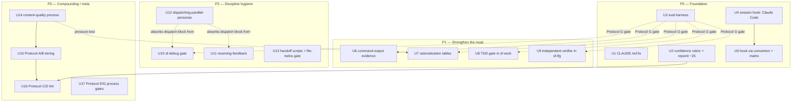
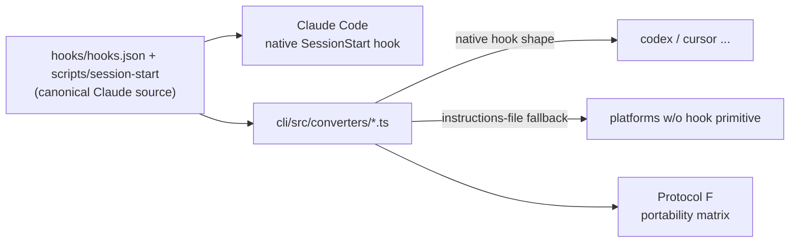

# feat: Port Superpowers discipline mechanisms into the SF plugin

## Summary

The plugin's domain breadth (60 skills, ~60 personas, an 11-target CLI, `docs/solutions/` institutional memory) is strong. Its *discipline-enforcement* layer is thin outside three hand-tuned clusters (`sf-plan` Verification Strategy, `sf-work` System-Wide Test Check, `sf-review` Non-Negotiable Gates). This plan ports the load-bearing *mechanisms* — not the content — from [obra/Superpowers](https://github.com/obra/Superpowers) that make skill-triggering reliable, gates un-skippable, and skill authorship pressure-tested, and adapts each to Salesforce's failure modes.

Scope is the teardown's full P0–P3 roadmap, delivered in four dependency-ordered phases. P0 is foundational and cheap (repo hygiene, a skill-triggering eval harness, a session-start hook) and deliberately lands first because Protocol G — "no gate-wording edit ships without an eval run" — is unenforceable until the eval harness exists. P1 sharpens the three existing gates. P2 fills the missing discipline skills (TDD, debugging, receiving-feedback, parallel-dispatch). P3 makes the whole thing self-reinforcing (content-quality process, skill tiering, lint checks).

This is a plan to modify **this repo** (the plugin itself). Its "product" is markdown under `skills/` plus the Bun CLI under `cli/`; most units edit skill prose, a few edit `cli/src/`, and the verification story is split between `bun test` (for CLI code) and a new shell-based skill-triggering harness (for prose).

---

## Problem Frame

The teardown identifies 14 gaps and 7 standardization protocols. Recon against the current tree (commit `65966fc`, v3.1.0-beta.3) confirms every structural gap is still real:

- No `hooks/` directory anywhere → skill-triggering is probabilistic (description-match only). An admin who types "quick fix for this trigger" can miss `sf-work` entirely and get zero governor/sharing/bulk checking, silently.
- No `tests/` or `evals/` for skill triggering → gate-wording is edited blind; Protocol G cannot be enforced.
- `CLAUDE.md` is gitignored yet referenced by ~every skill footer → a fresh clone or non-Claude harness install hits a dead reference.
- ~25 personas cite an "anchored confidence rubric in the subagent template" that does not exist anywhere in the repo.
- `sf-debug` is generic 5-step boilerplate with no `Principles enforced` header; its real rigor sits unwired in a co-located persona.
- `file-todos` is wired to nothing — its "Integration with Workflow" section is aspirational prose.
- The three real gates are self-graded, carry no rationalization tables, and accept self-reported yes/no instead of pasted command output.

The failure mode is not missing breadth — it is that the plugin's own best skills (`sf-plan`, `sf-work`, `sf-review`) already prove the discipline bar the rest of the catalog doesn't meet.

---

## Requirements

Grounded in the origin teardown's 14 gaps and Protocols A–G. Grouped by phase.

**P0 — Foundation**
- R1. Fix the gitignored/dangling `CLAUDE.md` reference so no shipped skill footer points at an unresolvable path (Gap 14). Principle 6.
- R2. Author the missing `subagent-confidence-rubric.md` and repoint the ~25 referencing personas (15 `sf-review` + 6 `sf-doc-review` + 4 `sf-plan`) at a resolvable relative path; give `sf-review`'s dedup step a defined confidence/merge mechanism (Gap 11, Repo-Hygiene item 3). Principle 5.
- R3. Add a lightweight, single-turn skill-triggering eval harness that mechanically asserts correct skill auto-triggering and detects premature action (Gap 2). Principle 2.
- R4. Add a deterministic Claude Code `SessionStart` hook that injects a compact discipline primer every cold start (Gap 1). Principle 3.
- R5. Route hook emission through the existing CLI converters (not 11 hand-authored scripts) and maintain a hook-portability matrix (Gap 1, Protocol F, Caveat 1). Principle 6.

**P1 — Strengthen the moat**
- R6. Require literal pasted command output as evidence at each of the three existing gate clusters instead of self-reported yes/no (Gap 5). Principle 2.
- R7. Retrofit rationalization ("Excuse → Reality") tables onto `sf-plan`, `sf-work`, `sf-review`'s gates, seeded from real SF-context excuses (Gap 7). Principle 3.
- R8. Add a Salesforce TDD red/green/refactor discipline gate distinct from `test-factory` (Gap 3). Principle 2.
- R9. Insert an independent-verifier dispatch between `sf-lfg` Stage 3 and Stage 4 so the System-Wide Test Check is confirmed from a clean context, not self-graded (Gap 10). Principle 3.

**P2 — Discipline / process hygiene**
- R10. Promote the co-located `sf-bug-reproduction-validator` process into `sf-debug` as a mandatory gate, add an SF 3-strikes escalation rule and a governor-snapshot defense-in-depth pattern (Gap 4). Principle 3.
- R11. Add a receiving-feedback discipline to `sf-resolve-pr-feedback` (verify-before-agreeing, batch-ask, source-differentiated trust), softened for internal-team culture; add a light anti-sycophancy voice note (Gap 6, Gap 12, Caveat 4). Principle 3.
- R12. Extract a shared `dispatching-parallel-personas` skill and have the 13 duplicating skills reference it (Gap 8). Principle 6.
- R13. Add `sf-task-brief` / `sf-review-package` context-handoff scripts, and wire `file-todos` into `sf-lfg` as a real gate — no advance to Review while a `p0` todo is open (Gap 9). Principle 2.

**P3 — Compounding / meta**
- R14. Extend `create-agent-skills` with a scaled-down bulletproofing / content-quality process (pressure scenarios, Match-the-Form-to-the-Failure, SDO rule) (Gap 13). Principle 6.
- R15. Add Protocol A/B — a `tier:` frontmatter declaration (`discipline-gate` / `workflow` / `utility`) with mandatory-sections-per-tier, applied to the discipline-gate skills and rolled out across the catalog (Protocols A, B). Principle 1.
- R16. Add Protocol C/D lint checks in the CLI — flag `description` fields containing step-count language, and verify every "confidence rubric" reference resolves to a real file (Protocols C, D). Principle 2.
- R17. Add Protocol E/G process gates — a `docs/pressure-tests/` record and a documented eval-harness-before-gate-edit rule (Protocols E, G). Principle 2.

**Non-negotiable preservation constraints** (from teardown §6–7, apply to every unit):
- Do not fork the CLI into per-harness native manifests (Caveat 1). Hooks route through converters.
- Do not stack Iron-Law ceremony onto utility skills (`sf-pr-description`, `sf-report-bug`, `sf-demo-reel`, etc.) (Caveat 3). New gates only where discipline is clearly missing.
- Treat every ported rationalization row as a hypothesis pending pressure-testing (Caveat 5), not a validated transplant.

---

## Key Technical Decisions

- KTD1. **Hooks emit through `cli/src/converters/`, never hand-authored per platform.** The canonical Claude source gets `hooks/hooks.json` + a script; `BaseConverter` (or a per-converter step mirroring the existing MCP conversion) emits each platform's native hook/lifecycle shape. This preserves the plugin's real architectural advantage over Superpowers (Caveat 1). Platforms without a session-hook primitive fall back to an always-loaded instructions file, recorded in the portability matrix.
- KTD2. **The TDD gate folds into `sf-work` as a new Step 2.5 (Test-First: Red → Green → Refactor) between Step 2 and Step 3 — decided, not a standalone `sf-tdd` skill.** Folding avoids a 61st skill and a second discovery surface, and `sf-work` already owns implementation. It precedes the Step 4 System-Wide Test Check, which is a *completeness* gate, not a red/green loop.
- KTD3. **The independent verifier is a new narrow persona, not direct reuse of `sf-deployment-verification-agent`.** Research confirmed that persona is deploy-scoped (Go/No-Go for a deployment). A new read-only `sf-implementation-verifier` persona under `sf-review/references/personas/` re-runs the 5 System-Wide Test Check questions from a clean context. It reuses the deployment agent's "Do Not Trust the Report" posture but not its checklist.
- KTD4. **The eval harness lives at `tests/skill-triggering/` (repo root), shell-based, beside — not inside — `cli/tests/`.** It depends on the `claude` CLI (already required to use the plugin) and `--output-format stream-json`, which `bun test` cannot drive. Start single-turn only; multi-turn and haiku-tier variants are stretch (Caveat 2).
- KTD5. **Description/rubric lint is a separate pure function invoked from `parseSkills` and CI, not a mutation of `parseMarkdown`.** `cli/src/parser/markdown.ts` is a deliberately pure 11-line gray-matter wrapper; a `cli/src/lint/` module keeps it that way and matches the existing `bun test` structure.
- KTD6. **The forbidden-phrase list ships as a soft style note, not a hard ban.** Superpowers' "Thanks for catching that" ban is tuned for high-volume open-source rejection culture; SF usage skews to small internal admin/dev pairs (Caveat 4). Port the *structure* (verify before agreeing/disputing, batch-ask); leave the literal phrase-ban as guidance.
- KTD7. **`CLAUDE.md` is un-gitignored and committed** — the existing on-disk file was inspected and is clean (67 lines, no absolute paths, no secrets), so it ships as-is plus a short plugin-specific accept/reject block, rather than repointing ~60 footers at `PRINCIPLES.md`. The file already carries the frontmatter conventions, persona/skill split, and protected-directory rules the footers promise. Superpowers' tone is not copied (Caveat 6).
- KTD8. **Ported rationalization tables are marked as unvalidated hypotheses** until Protocol E pressure-testing (U14/U17) runs against Apex/Flow/LWC-context agents (Caveat 5). They ship, but the plan does not treat them as load-bearing on day one.

---

## High-Level Technical Design

### Phase dependency and sequencing

The eval harness (U3) is the linchpin: Protocol G makes it a prerequisite for shipping any gate-wording edit, so every P1/P2 prose gate depends on it as a *process* gate even where there is no code dependency.



### Session-hook emission flow (U4 → U5)



Hook output contract (from Claude Code docs): the script exits 0 and writes `{"hookSpecificOutput":{"hookEventName":"SessionStart","additionalContext":"..."}}` (or plain stdout). The `matcher` is `"startup"` (decided) and `additionalContext` stays compact — a pointer to `skills/index.md` plus the *names* of the three gate clusters, not their full bodies.

---

## Output Structure

New files this plan introduces (modifications to existing files are per-unit):

```text
hooks/
  hooks.json                                  # U4 — SessionStart declaration
scripts/
  session-start                               # U4 — primer-injecting hook script
  sf-task-brief                               # U13 — awk-extract task brief for dispatch
  sf-review-package                           # U13 — git diff -U10 review package
tests/
  skill-triggering/
    run-test.sh                               # U3 — single-turn triggering assertion
    prompts/
      quick-fix-trigger.txt                   # U3 — SF-specific seed prompts
      build-lead-autoassign.txt
      review-this-pr.txt
      i-know-what-sf-work-means.txt           # explicit-bypass test
cli/src/lint/
  description-sdo.ts                           # U16 — Protocol C lint
  rubric-resolvable.ts                         # U16 — Protocol D lint
skills/
  dispatching-parallel-personas/SKILL.md      # U12 — factored-out shared skill
  sf-review/references/
    subagent-confidence-rubric.md              # U2 — the missing rubric
  sf-review/references/personas/
    sf-implementation-verifier.md              # U9 — clean-context verifier
docs/pressure-tests/                           # U17 — Protocol E records (mirrors docs/solutions/)
```

The per-unit `**Files:**` sections remain authoritative; the implementer may adjust layout if a better shape emerges.

---

## Implementation Units

### Phase P0 — Foundation

### U1. Fix the gitignored / dangling `CLAUDE.md` reference

- **Goal:** Every shipped skill footer that says "see `CLAUDE.md`" resolves after a fresh clone or non-Claude install.
- **Requirements:** R1.
- **Dependencies:** none.
- **Files:** `.gitignore` (remove the `CLAUDE.md` entry at line 74), `CLAUDE.md` (add a short accept/reject criteria block), packaging config (confirm `CLAUDE.md` ships), spot-check 3–4 skill footers under `skills/*/SKILL.md`.
- **Approach:** Per KTD7, un-gitignore and commit the existing `CLAUDE.md`. It was inspected and is clean (67 lines, no absolute paths, no secrets), so no fresh authoring is needed — append a plugin-specific governance block with concrete criteria (e.g. "no new persona without a named owning skill", "no `PRINCIPLES.md` violation without a citation"). Do not copy Superpowers' tone (Caveat 6). Verify the CLI copies `CLAUDE.md` into converted outputs, or that footers still resolve on each target.
- **Patterns to follow:** `PRINCIPLES.md` governance-doc voice; the existing footer wording in `skills/sf-work/SKILL.md`.
- **Test scenarios:**
  - After removing the ignore, `git status` shows `CLAUDE.md` as trackable and a commit includes it.
  - Grep every `skills/*/SKILL.md` footer referencing `CLAUDE.md`; confirm the relative path resolves from the shipped tree.
  - Run the CLI conversion for one target (e.g. codex) and confirm the footer reference is not left dangling in the converted output.
- **Verification:** Fresh `git clone` into a temp dir contains `CLAUDE.md`; no skill footer points at a missing path.

### U2. Author `subagent-confidence-rubric.md` and repoint ~25 personas

- **Goal:** The confidence-rubric reference cited by ~25 personas resolves to a real file, and `sf-review`'s dedup step gains a defined confidence/merge mechanism.
- **Requirements:** R2.
- **Dependencies:** none.
- **Files:** create `skills/sf-review/references/subagent-confidence-rubric.md`; edit the ~25 referencing personas under `skills/sf-review/references/personas/` (15), `skills/sf-doc-review/references/personas/` (6), and `skills/sf-plan/references/personas/` (4: `sf-web-researcher.md`, `sf-session-historian.md`, `sf-issue-intelligence-analyst.md`, `sf-slack-researcher.md`); edit `skills/sf-review/SKILL.md` Step 4 (lines ~156–164). The exact set is enumerated mechanically by the U16 resolvability lint.
- **Approach:** Author a literal 3-tier scale (Confirmed by 2+ independent personas / Single-persona high-confidence / Speculative) and a literal merge/dedup rule (same `file:line` + same root cause → merge; conflicting severity → take the higher). Repoint each persona's sentence "Use the anchored confidence rubric in the subagent template" to a resolvable relative path (e.g. `../subagent-confidence-rubric.md` for `sf-review` personas; `../../sf-review/references/subagent-confidence-rubric.md` for cross-skill personas). Add the "present with confidence scores" mechanism to `sf-review` Step 4, referencing the rubric.
- **Patterns to follow:** the upstream `ce-code-review` "confidence-gated findings" pattern; the persona cross-reference style already used for `../sf-review/references/personas/`.
- **Test scenarios:**
  - Every one of the ~25 personas' rubric references resolves to `subagent-confidence-rubric.md` from that persona's directory (path-resolution check, later automated by U16/Protocol D).
  - `sf-review` Step 4 names the 3-tier scale and the merge rule explicitly, not as prose hand-wave.
  - Grep confirms zero remaining references to a "subagent template" that has no target file.
- **Verification:** The Protocol D resolvability lint (U16) passes on the full persona set; `sf-review`'s consolidation step is mechanically described.

### U3. Skill-triggering eval harness (single-turn)

- **Goal:** A mechanical regression backstop that asserts a seed prompt triggers the correct skill and no non-Skill tool call fired first.
- **Requirements:** R3.
- **Dependencies:** none. (Unblocks Protocol G for all later gate edits.)
- **Files:** create `tests/skill-triggering/run-test.sh`, `tests/skill-triggering/prompts/*.txt`, `tests/skill-triggering/README.md`.
- **Approach:** Mirror Superpowers' `run-test.sh SKILL PROMPT_FILE` shape: spawn `claude -p --plugin-dir <repo> --dangerously-skip-permissions --output-format stream-json`, parse the JSON event stream, assert (a) the target skill's `Skill` invocation appears, and (b) no non-Skill/non-todo tool call happened before it ("premature action"). Seed SF-specific prompts: "quick fix for this trigger" → `sf-work`/`sf-debug`; "let's build lead auto-assignment" → `sf-brainstorm` before code; "review this PR" → `sf-review`; an explicit-bypass prompt ("I know what sf-work means, just do it"). No dependency beyond the `claude` CLI. Multi-turn/haiku tiers are out of scope (Caveat 2, deferred).
- **Patterns to follow:** Superpowers `tests/explicit-skill-requests/` structure; the repo's existing shell conventions.
- **Test scenarios:**
  - `run-test.sh sf-review review-this-pr.txt` exits 0 when `sf-review` triggers with no premature tool call.
  - A deliberately mis-mapped prompt fails the assertion (harness catches a true negative, not just green-on-everything).
  - The explicit-bypass prompt asserts the intended routing (bypass honored or gate still fires, per the seed's expectation).
  - Harness runs offline-safe: missing `claude` CLI produces a clear skip/error, not a false pass.
- **Verification:** `bash tests/skill-triggering/run-test.sh` runs the seed battery and reports pass/fail per prompt.

### U4. Session-start hook for Claude Code

- **Goal:** Every Claude Code cold start injects a compact discipline primer unconditionally, making the three gates present regardless of description-match luck.
- **Requirements:** R4.
- **Dependencies:** none (but U5 depends on this).
- **Files:** create `hooks/hooks.json`, `scripts/session-start` (executable); confirm `.claude-plugin/plugin.json` needs no `hooks` key (hooks auto-discovered at plugin root).
- **Approach:** Declare a `SessionStart` hook with `"matcher": "startup"` (decided — startup only; measure post-compaction triggering via the eval harness and add `compact` later only if it degrades) pointing at `${CLAUDE_PLUGIN_ROOT}/scripts/session-start`. The script exits 0 and emits `hookSpecificOutput.additionalContext` containing the **compact primer** (decided): a pointer to `skills/index.md`, the three gate-cluster *names* (`sf-plan` Verification Strategy, `sf-work` System-Wide Test Check, `sf-review` Non-Negotiable Gates), and the routing hint that Salesforce work should enter a workflow skill before raw edits. Keep it well under ~1KB to bound per-session token cost. Set a modest `timeout`.
- **Patterns to follow:** Claude Code plugin hook docs contract (`hookSpecificOutput.additionalContext`); `skills/index.md` as the routing surface.
- **Test scenarios:**
  - `scripts/session-start` run standalone exits 0 and prints valid JSON with a non-empty `additionalContext`.
  - `additionalContext` payload byte size is under the ~1KB ceiling.
  - Injected text names all three gate clusters and points at `skills/index.md`.
  - `/hooks` in a Claude Code session lists the hook under `SessionStart` (manual acceptance check, documented in the unit).
  - Covers R4. A cold session with a bare "quick fix for this trigger" prompt shows the primer in context (paired with U3 harness assertion where feasible).
- **Verification:** Hook registered under `SessionStart`; primer present in a fresh session; payload within size budget.

### U5. Route hook emission through the CLI converters + portability matrix

- **Goal:** The session hook reaches the other platforms through `cli/src/converters/`, not hand-authored per platform, with an explicit support matrix.
- **Requirements:** R5. Principle 6, Caveat 1, Protocol F.
- **Dependencies:** U4.
- **Files:** `cli/src/converters/base.ts` (or per-converter files: `codex.ts`, `cursor.ts`, etc.), `cli/src/parser/plugin.ts` (surface the hook source in the parsed `ClaudePlugin`), a new `docs/hook-portability-matrix.md`, `cli/tests/` (new converter test).
- **Approach:** Add the hook source to the canonical parse (a `hooks` field on `ClaudePlugin`), then an emission step per converter mirroring the existing MCP conversion (which already handles divergent formats — Cursor `mcp.json`, Codex `config.toml`). Classify each of the 11 targets into: native `SessionStart` hook / in-process lifecycle callback / always-loaded instructions-file fallback. Emit the correct shape per class. Record the classification in the portability matrix (Protocol F). Do not fork into hand-authored scripts (Caveat 1).
- **Patterns to follow:** `convertMcp` in `cli/src/converters/codex.ts`; the `CONVERTERS` registry in `cli/src/index.ts`; `BaseConverter.transform()`.
- **Test scenarios:**
  - A `bun test` converter test asserts that for a native-hook target, the converted output contains the platform's hook declaration referencing the session-start script.
  - For an instructions-file-fallback target, the primer text lands in that platform's always-loaded file.
  - The matrix doc lists all 11 targets with a hook-class each; no target is silently omitted.
  - Running the full CLI conversion produces no path/reference regressions in existing outputs (existing converter tests still green).
- **Verification:** `bun test` green including the new converter test; matrix covers 11/11 targets.

---

### Phase P1 — Strengthen the moat

### U6. Require literal command-output evidence at the three gates

- **Goal:** Each existing gate demands pasted command output, not a self-reported yes/no.
- **Requirements:** R6. Principle 2. (Protocol G: ship with a U3 eval run.)
- **Dependencies:** U3 (process gate).
- **Files:** `skills/sf-plan/SKILL.md` (Step 5 Verification Strategy, ~lines 119–127), `skills/sf-work/SKILL.md` (Step 4 System-Wide Test Check, ~lines 132–146), `skills/sf-review/SKILL.md` (Non-Negotiable Gates / Output).
- **Approach:** At each gate, replace self-report with a requirement to paste fresh command output in the same message: `sf apex run test --result-format human` (coverage %), `sf project deploy report` / `--dry-run`, actual `Limits.get*()` values where a governor claim is made. Reuse Superpowers' claim-type-table structure with SF rows (what counts as evidence vs what doesn't — "previous run" and "agent reports success" do not). This is a wording change to three existing files, not new architecture. While here, clean the Proof-artifact run-on formatting in `sf-plan` Step 5.
- **Patterns to follow:** Superpowers `verification-before-completion` claim-type table; the existing five-field/five-question structures (extend, don't replace).
- **Test scenarios:**
  - `sf-plan` Step 5, `sf-work` Step 4, and `sf-review` gates each name the exact command whose output must be pasted.
  - Each gate states explicitly that a prior run or an agent's self-report is not acceptable evidence.
  - Test expectation for prose: paired U3 eval run confirms the edited skills still trigger; Protocol E pressure scenario (U14/U17) confirms an agent under deadline cannot satisfy the gate with a bare "tests pass".
- **Verification:** The three gates require pasted output; U3 harness re-run shows no triggering regression (Protocol G).

### U7. Rationalization tables on the three gate clusters

- **Goal:** Each of the three gates closes with an "Excuse → Reality" table that pre-empts the excuses used to skip it under deadline pressure.
- **Requirements:** R7. Principle 3. Caveat 5, KTD8.
- **Dependencies:** U3 (process gate); pressure-testing feeds back from U14.
- **Files:** `skills/sf-plan/SKILL.md`, `skills/sf-work/SKILL.md`, `skills/sf-review/SKILL.md`.
- **Approach:** Add a ≥5-row table to each gate, mirroring the row format proven in `skills/sf-strategy/references/interview.md` (`anti-pattern label` / quoted rationalization / scripted reality). Seed SF-context rows: "this trigger only ever gets one record from the UI" → Data Loader / REST / Flow bulk DML bypass that on day one; "governor limits don't matter in a scratch org" → scratch-org limits mirror production EE; "we'll fix sharing after it ships, it's admin-only for now" → profile/perm-set assignment is a no-redeploy config change and `without sharing` doesn't self-correct. Mark each table as an unvalidated hypothesis pending Protocol E (KTD8).
- **Patterns to follow:** `skills/sf-strategy/references/interview.md` anti-pattern-plus-pushback rows.
- **Test scenarios:**
  - Each of the three gates has a rationalization table with ≥5 rows.
  - Rows are SF-specific and quote a realistic rationalization, not a generic one.
  - Each table carries the "pending pressure-test validation" marker.
  - Test expectation for prose: U3 eval run shows no triggering regression; U14/U17 pressure scenarios are the real validation.
- **Verification:** Three tables present, ≥5 rows each, marked as hypotheses; U3 re-run green.

### U8. TDD discipline gate in `sf-work`

- **Goal:** No Apex/LWC/Flow production logic without a failing test first, enforced as a red/green/refactor step distinct from `test-factory`.
- **Requirements:** R8. Principle 2. KTD2.
- **Dependencies:** U3 (process gate).
- **Files:** `skills/sf-work/SKILL.md` (new **Step 2.5 (Test-First: Red → Green → Refactor)** between Step 2 "Internal-First Implementation" and Step 3 "Implementation Standards"; renumber downstream if needed); optional cross-link from `skills/test-factory/SKILL.md`.
- **Approach:** Insert Step 2.5 with an SF Iron Law: `NO APEX/LWC/FLOW PRODUCTION LOGIC WITHOUT A FAILING TEST FIRST`. RED = write the `@isTest` method or Jest spec asserting not-yet-built behavior and run it to confirm failure (`sf apex run test` / `npm run test:unit`); GREEN = minimal implementation; REFACTOR = simplify with tests green. Add a delete-and-restart forcing function (code written before its test is deleted, not "kept as reference"). Add SF rationalization rows: "I'll write tests after to hit coverage" → coverage-after asserts what the code does, not what it should, and won't catch a bulk-safety regression baked into the untested draft. This precedes — does not replace — the Step 4 System-Wide Test Check (a completeness gate). Standalone `sf-tdd` was considered and rejected (KTD2).
- **Patterns to follow:** Superpowers `test-driven-development` Iron Law + delete-and-restart; the existing `sf-work` step structure and `Principles enforced` header.
- **Test scenarios:**
  - Step 2.5 states the Iron Law and the RED command to run before writing production logic.
  - Downstream steps renumber cleanly; Step 4 System-Wide Test Check still follows.
  - The step is scoped to production logic, exempting pure config where behavior assertion is genuinely N/A but still requiring before/after assertion for Flow/validation-rule changes.
  - Test expectation for prose: U3 eval run confirms `sf-work` still triggers; Protocol E scenario confirms an agent cannot skip RED under a "just a quick change" excuse.
- **Verification:** Step 2.5 present and ordered before Step 4; U3 re-run green.

### U9. Independent-verifier dispatch in `sf-lfg`

- **Goal:** The System-Wide Test Check is confirmed by a fresh clean-context subagent between Stage 3 and Stage 4, not self-graded.
- **Requirements:** R9. Principle 3. KTD3.
- **Dependencies:** U3 (process gate). Related to U6 (evidence) and U8.
- **Files:** create `skills/sf-review/references/personas/sf-implementation-verifier.md`; edit `skills/sf-lfg/SKILL.md` (new Stage 3.5 after the Stage 3 gate, ~line 136; add matching Abort Conditions entry, ~lines 254–266); wire the persona name into `sf-review`'s comprehensive dispatch list if reused there.
- **Approach:** Author a read-only `sf-implementation-verifier` persona that re-runs the 5 System-Wide Test Check questions from a clean context and carries explicit "Do Not Trust the Report" language (verify even the implementer's stated rationale). Insert a Stage 3.5 (VERIFY) in `sf-lfg` that dispatches it before the Stage 4 review personas fan out; add an Abort Condition for a failed independent verification. Per KTD3, do not overload the deploy-scoped `sf-deployment-verification-agent`.
- **Patterns to follow:** `skills/sf-review/references/personas/sf-deployment-verification-agent.md` ("Do Not Trust the Report" posture); the persona-dispatch and gate-line conventions in `sf-lfg`.
- **Test scenarios:**
  - `sf-lfg` has a Stage 3.5 that dispatches `sf-implementation-verifier` before Stage 4.
  - A matching Abort Conditions entry fires when independent verification fails.
  - The persona re-derives the 5 checks independently and is read-only (no Edit/Write).
  - Test expectation for prose: U3 eval run confirms `sf-lfg` still triggers; a dry-run walkthrough of the pipeline shows the verifier inserted at the right seam.
- **Verification:** Stage 3.5 present with abort wiring; persona is read-only and clean-context.

---

### Phase P2 — Discipline / process hygiene

### U10. Promote the debugging gate into `sf-debug`

- **Goal:** `sf-debug` carries a mandatory reproduce-before-fix gate and a 3-strikes escalation rule instead of generic boilerplate.
- **Requirements:** R10. Principle 3. (Protocol G process gate via U3.)
- **Dependencies:** U3 (process gate); U12 (absorbs the dispatch block).
- **Files:** `skills/sf-debug/SKILL.md` (replace the generic Procedure; add a `Principles enforced` header — currently missing); reference the already-co-located `skills/sf-debug/references/personas/sf-bug-reproduction-validator.md`.
- **Approach:** Wire the persona's existing 6-step process (Parse Bug Report → Context Analysis → Code Archaeology → Reproduction Attempt → 5-bucket Root Cause Classification → Validation Report) into `sf-debug`'s Procedure as a required gate with Iron Law `NO FIXES WITHOUT ROOT CAUSE INVESTIGATION FIRST`. Add an SF 3-strikes rule: "3 failed trigger/governor-limit patches → stop proposing patch #4; ask whether this needs an async (Queueable/Batch) architecture change." Add an SF defense-in-depth pattern (Entry Point = trigger-handler guard, Business Logic = service-layer validation, Environment Guards = custom-metadata/feature-toggle checks, Debug Instrumentation = structured logging with `Limits.getQueries()`/`Limits.getDmlStatements()` snapshots at each boundary). Add the missing `Principles enforced` header to match sibling skills. The persona already exists — this is wiring plus a header, not new persona authoring.
- **Patterns to follow:** Superpowers `systematic-debugging` 4-phase + 3-strikes; sibling skills' `Principles enforced` header format.
- **Test scenarios:**
  - `sf-debug` Procedure requires reproduction + root-cause classification before any fix.
  - The 3-strikes rule is stated with the async-architecture escalation.
  - `sf-debug` gains a `Principles enforced` header consistent with siblings.
  - Test expectation for prose: U3 eval ("quick fix for this trigger" routes to `sf-debug`/`sf-work`, not raw edits); Protocol E scenario confirms an agent cannot jump straight to a patch.
- **Verification:** `sf-debug` carries the mandatory gate, 3-strikes rule, and principles header; U3 re-run green.

### U11. Receiving-feedback discipline in `sf-resolve-pr-feedback`

- **Goal:** The implementer has a prescribed behavior for verifying, pushing back, deferring, or conceding on reviewer disagreement — not just a "Dispute → flag for discussion" bucket.
- **Requirements:** R11. Principle 3. Caveat 4 (softened).
- **Dependencies:** U3 (process gate); U12 (dispatch block).
- **Files:** `skills/sf-resolve-pr-feedback/SKILL.md`; `skills/sf-resolve-pr-feedback/references/personas/sf-pr-comment-resolver.md`; a short voice note added to `skills/create-agent-skills/SKILL.md` (Gap 12).
- **Approach:** Port Superpowers' 6-step pattern (READ → UNDERSTAND → VERIFY → EVALUATE → RESPOND → IMPLEMENT one at a time) into the Dispute path, near-unchanged since it is general engineering epistemics. Add the SF-specific rule: before agreeing *or* disputing a governor-limit or sharing-model claim, verify it against actual `Limits.get*()` math or a `System.runAs` repro rather than taking either side's word. Add an unclear-feedback gate (batch-ask about all unclear items before implementing any). Per Caveat 4/KTD6, ship the forbidden-phrase list as a soft style note, not a hard ban. Add the anti-sycophancy voice note to `create-agent-skills` so the pattern doesn't creep into new skills.
- **Patterns to follow:** Superpowers `receiving-code-review` 6-step pattern; the persona's existing SF post-change checks.
- **Test scenarios:**
  - The Dispute path prescribes verify-before-agree/dispute with the `Limits.get*()` / `System.runAs` check.
  - A batch-ask gate exists for unclear feedback.
  - The forbidden-phrase guidance is a soft note, not a hard ban.
  - `create-agent-skills` carries the anti-sycophancy voice note.
  - Test expectation for prose: U3 eval confirms `sf-resolve-pr-feedback` still triggers on "resolve PR review feedback".
- **Verification:** Dispute path has a real behavior spec; voice note present in `create-agent-skills`.

### U12. Extract `dispatching-parallel-personas` shared skill

- **Goal:** The persona-dispatch pattern lives in one skill that the 13 duplicating skills reference, instead of 13 near-verbatim copies.
- **Requirements:** R12. Principle 6.
- **Dependencies:** none (U10, U11 reference it once it exists).
- **Files:** create `skills/dispatching-parallel-personas/SKILL.md`; edit the 13 skills carrying the block (`create-agent-skills`, `sf-brainstorm`, `sf-compound`, `sf-doc-review`, `sf-debug`, `sf-deepen`, `sf-plan`, `sf-polish`, `sf-lfg`, `sf-product-pulse`, `sf-resolve-pr-feedback`, `sf-review`, `sf-work`); update `skills/index.md`; bump the four manifests.
- **Approach:** Factor the common "personas are prompt assets, not registered agents, dispatched via the Task tool, parallel on Claude Code / inline-sequential elsewhere" explanation into one skill, and add the two mechanically useful additions Superpowers has: the explicit same-response-vs-one-per-response parallelism rule, and a same-file-conflict check (two personas both proposing edits to the same trigger handler or LWC). Each of the 13 skills keeps its *specific* persona list but replaces the shared explanation with a reference. Add to `skills/index.md` and bump `.claude-plugin/plugin.json`, `.claude-plugin/marketplace.json`, `.codex-plugin/plugin.json`, `.cursor-plugin/plugin.json`.
- **Patterns to follow:** the existing shared-reference pattern; `create-agent-skills` manifest-bump checklist.
- **Test scenarios:**
  - The new skill states the same-response parallelism rule and the same-file-conflict check.
  - All 13 skills reference it and no longer carry the full duplicated block (a wording refinement now touches 1 file, not 13).
  - `skills/index.md` lists the new skill; all four manifests carry the bumped version.
  - Test expectation for prose: U3 eval confirms the 13 edited skills still trigger on their own phrases; a converter run shows the new skill ships to targets.
- **Verification:** One shared skill, 13 references, index + manifests updated; `bun test` green.

### U13. Handoff scripts + wire `file-todos` into `sf-lfg` as a gate

- **Goal:** Persona dispatches use fresh extracted context instead of accumulating stale paste, and `file-todos` actually blocks pipeline advancement.
- **Requirements:** R13. Principle 2.
- **Dependencies:** U9 (Stage structure), U12 (dispatch reference).
- **Files:** create `scripts/sf-task-brief`, `scripts/sf-review-package`; edit `skills/sf-lfg/SKILL.md` (Stage 3→4 transition gate) and `skills/file-todos/SKILL.md` (correct the aspirational "Integration with Workflow" prose to match real wiring).
- **Approach:** Mirror Superpowers' awk-extraction / `git diff -U10` scripts: `sf-task-brief` extracts a single unit's brief for a dispatch; `sf-review-package` builds a diff package for review personas. Wire `file-todos` into `sf-lfg`'s Stage 3→4 transition as a real gate — no advance to Review while a `p0` todo is `active`/`blocked`. Update `file-todos`'s integration section so it describes the *actual* wiring (currently it claims integrations that grep proves don't exist).
- **Patterns to follow:** Superpowers `subagent-driven-development` handoff scripts; `file-todos`' `ls todos/*-active-*.md` / `mv` transition ops.
- **Test scenarios:**
  - `scripts/sf-task-brief` extracts one unit's brief from a plan file; `scripts/sf-review-package` emits a `git diff -U10` package.
  - `sf-lfg` refuses Stage 3→4 advance while a `p0` todo is open (gate stated with the check command).
  - `file-todos`' integration prose matches the real wiring (no aspirational claims).
  - Test expectation for scripts: run each against a sample plan/diff and confirm expected extraction; U3 eval confirms `sf-lfg` still triggers.
- **Verification:** Scripts run and produce expected output; `sf-lfg` has a real `file-todos` gate; `file-todos` prose is accurate.

---

### Phase P3 — Compounding / meta

### U14. Content-quality + pressure-testing process in `create-agent-skills`

- **Goal:** New/edited discipline-gate skills go through a scaled-down bulletproofing recipe before merge, closing the two-tier rigor split at its source.
- **Requirements:** R14. Principle 6.
- **Dependencies:** none (feeds U7's validation).
- **Files:** `skills/create-agent-skills/SKILL.md` (extend in place — a sibling `sf-writing-skills` skill is an implementation-time option but not required); reference `docs/pressure-tests/` (created in U17).
- **Approach:** Add a scaled-down bulletproofing recipe: for any new/edited `discipline-gate` skill, run 2–3 pressure scenarios before merge ("under a sprint deadline, does the agent skip a Verification Strategy field?"), document the outcome without the change, patch to close exactly that loophole, retest — RED/GREEN/REFACTOR applied to skill prose. Add the "Match the Form to the Failure" classification (skips under pressure / complies but wrong shape / omits a required element / should be conditional → the right *form* of guidance, with the warning that a bare prohibition can backfire). Adopt the SDO rule (a `description` states only the trigger condition, never step count) and note the U16 lint enforces it.
- **Patterns to follow:** Superpowers `writing-skills` + `testing-skills-with-subagents.md` + `persuasion-principles.md`.
- **Test scenarios:**
  - `create-agent-skills` documents the pressure-testing recipe and Match-the-Form-to-the-Failure table.
  - The SDO rule is stated and cross-references the U16 lint.
  - Test expectation: none — process/authoring guidance, no runtime surface. Validated by using it to pressure-test U7's tables (U17).
- **Verification:** The content-quality process exists and is referenced by Protocol E (U17).

### U15. Protocol A/B — skill tiering declaration + mandatory sections

- **Goal:** The plugin's bimodality becomes documented policy: each skill declares a tier, and each tier has required sections.
- **Requirements:** R15. Principle 1.
- **Dependencies:** U14.
- **Files:** add `tier:` frontmatter to the discipline-gate skills first (`sf-plan`, `sf-work`, `sf-review`, `sf-polish`, `sf-lfg`, `sf-debug`), then across the catalog; document Protocol A/B in `create-agent-skills`; update `CLAUDE.md` frontmatter conventions (U1).
- **Approach:** Introduce `tier: discipline-gate | workflow | utility` (net-new field). Define mandatory sections per tier: `discipline-gate` → named gate list with abort/proceed criteria + rationalization table (≥5 rows) + red-flags self-check + `Principles enforced` header; `workflow` → numbered phases + artifact path template + self-review checklist; `utility` → exempt from gate/rationalization requirements (keeps the Salesforce-Angle bullets). Apply to the discipline-gate skills, then roll out across the 60-skill catalog (tiering pass). This makes Caveat 3's bimodality intentional. Note: `PRINCIPLES.md` lines 3/5 still reference an `agents/` dir that no longer exists post-V3.1 — correct that reference opportunistically.
- **Patterns to follow:** existing `Principles enforced` headers; the frontmatter conventions in `create-agent-skills`.
- **Test scenarios:**
  - Every discipline-gate skill declares `tier: discipline-gate` and has the four mandatory sections.
  - Utility skills are explicitly exempt and unchanged in ceremony.
  - The tier field parses cleanly through `cli/src/parser/markdown.ts` (no converter breakage).
  - Test expectation: `bun test` for parser/converter regressions; U3 eval confirms no triggering regression on the retiered skills.
- **Verification:** Tiers declared and sections present per tier; `bun test` green.

### U16. Protocol C/D — description SDO lint + rubric-resolvability lint

- **Goal:** Two dangling-reference/anti-pattern classes are caught mechanically in CI, not by review vigilance.
- **Requirements:** R16. Principle 2. Protocols C, D.
- **Dependencies:** U2 (rubric exists), U15 (tier concept). KTD5.
- **Files:** create `cli/src/lint/description-sdo.ts`, `cli/src/lint/rubric-resolvable.ts`; wire into `cli/src/parser/plugin.ts` (`parseSkills`) or a CLI `lint` command; add `cli/tests/lint/*.test.ts`.
- **Approach:** Per KTD5, keep `parseMarkdown` pure; add a `cli/src/lint/` module. `description-sdo.ts` flags `description` fields containing step-count language ("5-step", "checklist", digit+"phases"). `rubric-resolvable.ts` greps every "confidence rubric"/"subagent template" mention and asserts the referenced path resolves to a real file — the specific failure mode from Gap 11 must not recur silently. Run both under `bun test` and/or a `lint` CLI subcommand.
- **Patterns to follow:** `cli/tests/parser/markdown.test.ts` structure; `bun:test` imports.
- **Test scenarios:**
  - `description-sdo` flags a description containing "5-step" and passes a clean trigger-only description.
  - `rubric-resolvable` fails on a persona referencing a non-existent rubric path and passes once U2's file exists and references are repointed.
  - Both lints run under `bun test` and exit non-zero on violation (CI-usable).
  - Running against the current tree after U2 shows the rubric lint green across all ~25 personas.
- **Verification:** `bun test` includes both lints; they catch seeded violations and pass the real tree.

### U17. Protocol E/G — pressure-test records + eval-harness-before-gate-edit rule

- **Goal:** The process guarantees behind P1/P2 are written down and enforceable: gate edits carry eval evidence, discipline-gate changes carry pressure-test records.
- **Requirements:** R17. Principle 2. Protocols E, G.
- **Dependencies:** U3 (harness), U14 (pressure recipe).
- **Files:** create `docs/pressure-tests/` (mirroring `docs/solutions/` structure) with a README/schema; document Protocol E/G in `CONTRIBUTING.md` and `create-agent-skills`; optionally a CI note referencing `tests/skill-triggering/`.
- **Approach:** Protocol E: no discipline-gate-tier skill/persona ships or is edited without ≥2 documented pressure scenarios + outcomes, recorded under `docs/pressure-tests/`. Protocol G: any edit to a discipline-gate skill's gate language must be accompanied by a before/after run of the U3 harness. Backfill the P1 rationalization tables (U7) and evidence edits (U6) with the first pressure-test records, retroactively validating KTD8's hypotheses.
- **Patterns to follow:** `docs/solutions/` folder + `schema.yaml` convention; `CONTRIBUTING.md` voice.
- **Test scenarios:**
  - `docs/pressure-tests/` exists with a documented record shape and at least one real record (validating a U7 table).
  - `CONTRIBUTING.md` states the eval-harness-before-gate-edit rule (Protocol G) and the pressure-test rule (Protocol E).
  - Test expectation: none — process/documentation. Its effectiveness is measured by U7's tables being validated (or revised) via recorded pressure tests.
- **Verification:** `docs/pressure-tests/` populated; Protocols E/G documented; at least one U7 table validated by a record.

---

## Scope Boundaries

**In scope:** the full P0–P3 roadmap (Gaps 1–14, Protocols A–G) as 17 units across four phases.

### Deferred to Follow-Up Work
- Multi-turn and haiku-tier eval variants, and the heavier tmux/LLM-judge `superpowers-evals`-style harness (Caveat 2). Start single-turn only (U3).
- Full retroactive tiering of all 60 skills beyond the discipline-gate set — U15 lands the discipline-gate tier and the policy; the exhaustive utility/workflow sweep can follow.

### Outside this product's identity
- Porting Superpowers' hand-maintained per-harness manifest model (Caveat 1) — the CLI converter model is the plugin's advantage; do not regress it.
- Superpowers' brainstorming visual companion (local WebSocket + browser mockup UI) — no Salesforce angle, adds a Node runtime dependency, duplicates `sf-brainstorm` + `sf-design-lens-reviewer` (teardown §11 note).
- Copying Superpowers' `CLAUDE.md` tone or its "94% PR rejection rate" framing (Caveat 6).
- A standalone `sf-tdd` skill — considered and rejected in favor of folding TDD into `sf-work` (KTD2).

---

## Resolved Decisions

These four forks were resolved with the user before implementation:

- **TDD placement (U8):** fold into `sf-work` as a new **Step 2.5 (Test-First: Red → Green → Refactor)** between Step 2 and Step 3 — not a standalone `sf-tdd` skill. Avoids a 61st skill and a second trigger surface.
- **Hook matcher (U4):** `"matcher": "startup"` only. Inject the primer once per cold start for lowest token cost; measure post-compaction triggering via the eval harness and add `compact` later only if triggering degrades.
- **Hook primer size (U4/U5):** compact pointer — `skills/index.md` link + the three gate-cluster *names* + the "enter a workflow skill before raw edits" routing hint, kept well under ~1KB. Not the full-field primer. Revisit only if the eval harness shows under-triggering.
- **CLAUDE.md content (U1):** commit the existing on-disk file. Inspected and clean — 67 lines, no absolute paths, no secrets — so it is un-gitignored and committed as-is plus the accept/reject block. No fresh governance doc needed.

### Deferred execution-time unknowns
- Exact `additionalContext` payload wording (U4) — finalized when the compact primer is measured against the eval harness.
- The precise per-platform hook shape for each of the 11 converter targets (U5) — resolved per converter during implementation, recorded in the Protocol F matrix.

---

## Risks & Mitigations

- **Rationalization tables unvalidated on Apex-context agents (Caveat 5).** The persuasion research validated general-coding agents, not Apex/Flow/LWC specifically. *Mitigation:* KTD8 marks tables as hypotheses; U17/Protocol E validates them before they are trusted as load-bearing.
- **Hook context bloat.** Every session pays the primer's token cost. *Mitigation:* U4 size budget (well under ~1KB) and the compact-pointer default; measure via U3.
- **Eval harness cost/flakiness in CI.** U3 spawns real `claude` runs (API budget, non-determinism). *Mitigation:* single-turn tier only; offline-safe skip when the CLI is absent; run as a manual/nightly gate rather than a blocking per-commit check initially.
- **Cross-platform hook parity gaps.** Some of the 11 targets lack a session-hook primitive. *Mitigation:* U5's instructions-file fallback + Protocol F matrix make the gap explicit rather than silent.
- **~25-persona repoint churn (U2).** A mass edit risks inconsistent relative paths across skill boundaries (cross-skill personas need a deeper relative path than in-skill ones). *Mitigation:* the U16 rubric-resolvability lint is the mechanical backstop; land U2 and U16 close together.
- **Over-ceremony regression (Caveat 3).** Adding gates broadly could make the plugin heavier than teams tolerate. *Mitigation:* U15 tiering makes `utility` skills explicitly exempt; new gates land only on `sf-debug` and `sf-work`'s TDD step.

---

## Phased Delivery

- **P0 (U1–U5):** foundational and cheap; unblocks everything. U3 must precede any gate-wording edit (Protocol G). U1/U2 are near-pure hygiene and can land first.
- **P1 (U6–U9):** strengthens the three existing gates; each ships with a U3 eval run.
- **P2 (U10–U13):** fills the missing discipline skills; U12 lands before U10/U11 finalize their dispatch references.
- **P3 (U14–U17):** makes the system self-reinforcing; U14 → U15 → U16 order matters, and U17 backfills P1 with pressure-test evidence.

---

## Sources & Research

- Origin teardown: `Superpowers-vs-SF-Compound-Engineering-Teardown.md` (14 gaps, Protocols A–G, P0–P3 roadmap, Caveats 1–6).
- Prior related plan: `docs/plans/2026-03-02-feat-close-teardown-gaps-plan.md` (the *EveryInc* teardown — distinct lineage; this plan does not overlap it).
- Claude Code hook contract (external, implementation-guidance): plugin hooks live in `hooks/hooks.json` at plugin root (not `plugin.json`); `SessionStart` matchers `startup|resume|clear|compact`; context injection via `hookSpecificOutput.additionalContext` or plain stdout; paths via `${CLAUDE_PLUGIN_ROOT}`; default timeout 600s; exit 2 does not block SessionStart. This shaped KTD1 and U4/U5.
- Repo research (local): CLI converter pipeline (`BaseConverter.transform()` → `rewritePaths`/`rewriteAllRefs`, `CONVERTERS` registry in `cli/src/index.ts`, MCP conversion as the per-platform-format precedent); `cli/src/parser/markdown.ts` as the pure gray-matter chokepoint; exact gate locations (`sf-plan` Step 5, `sf-work` Step 4, `sf-review` Non-Negotiable Gates + Step 4 dedup bullet); `sf-lfg` 10-stage structure with insertion seam after the Stage 3 gate; `sf-bug-reproduction-validator` already co-located under `sf-debug`; `sf-deployment-verification-agent` is deploy-scoped; ~25 personas cite a non-existent confidence rubric; `file-todos` wired to nothing; `create-agent-skills` is structure-only; the 13-file persona-dispatch duplication.
- Governing principles: `PRINCIPLES.md` (cited by number per unit).
