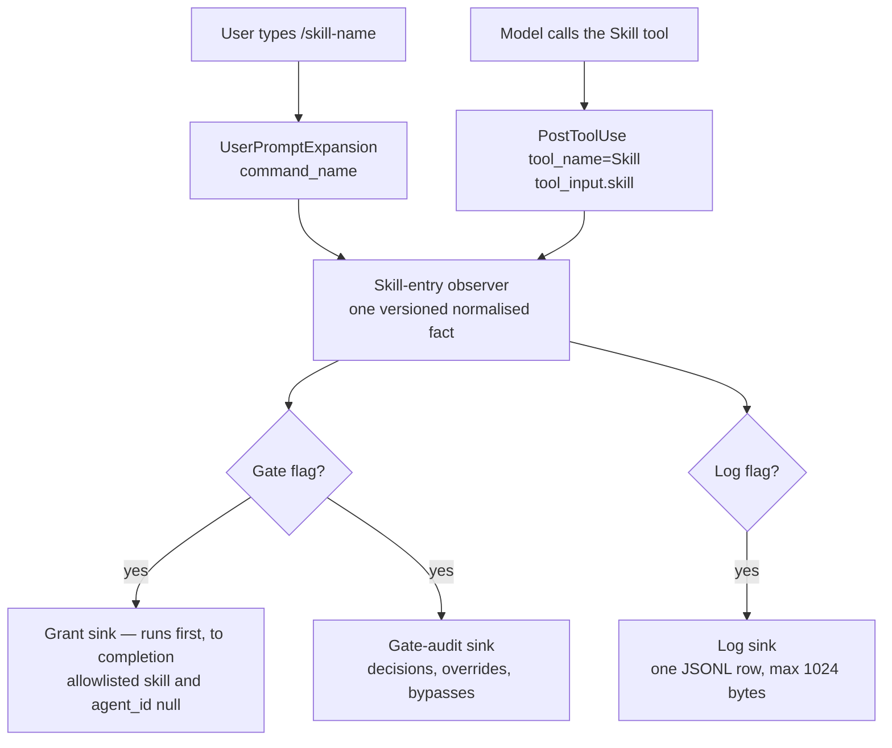
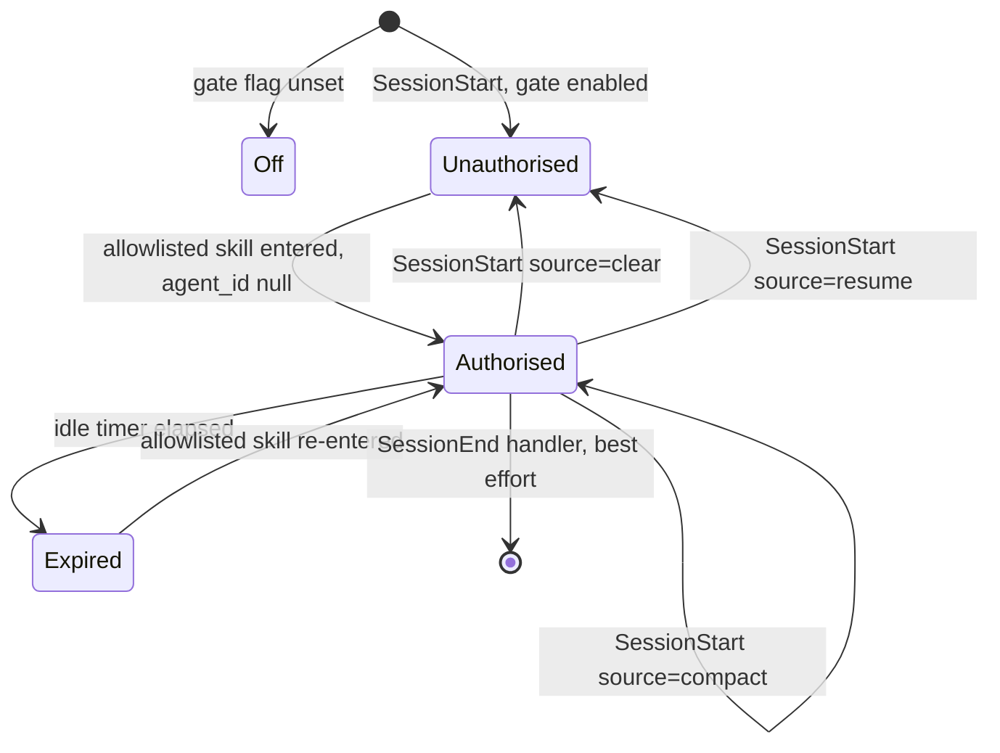
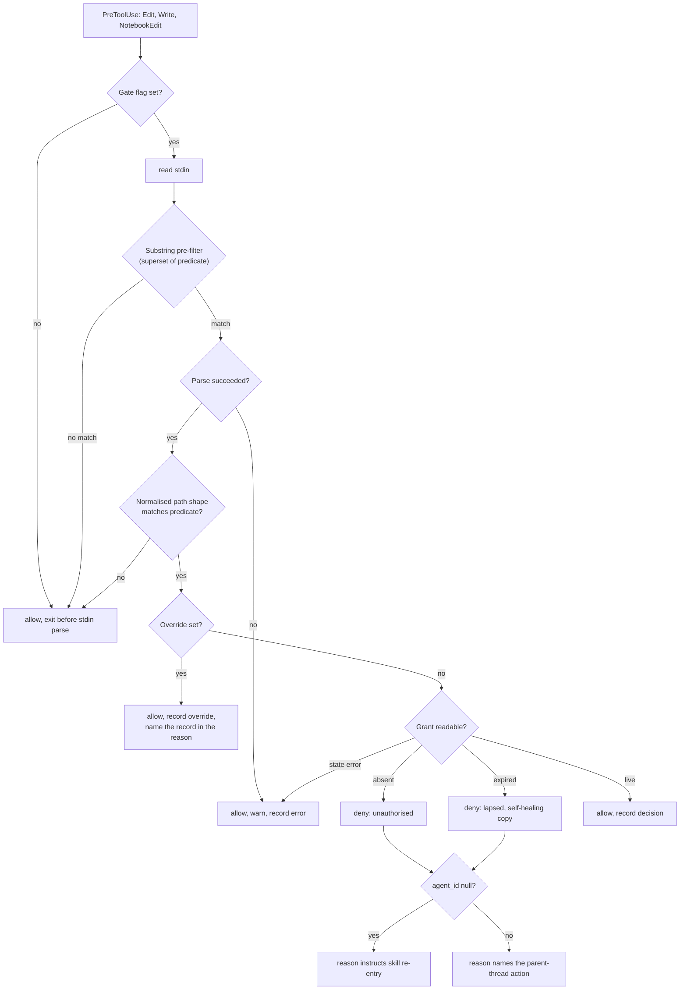

# Salesforce Metadata Gate and Skill-Usage Telemetry - Plan

## Goal Capsule

* **Objective:** A developer using this plugin does not drift into editing Apex, LWC, Flow, or object metadata without first entering a skill that carries the verification gates — and can see, from recorded evidence on their own machine rather than intuition, which of the plugin's skills their sessions actually reach. The log is local and opt-in, so the author learns this only from their own instrumented installs and from logs a user chooses to share; there is no collection path.

* **Means:** Two hooks on the Claude Code hook layer — a `PreToolUse` gate and a skill-entry observer — sharing one observation point and one state root (KTD1, KTD14).

* **Authority hierarchy:** `PRINCIPLES.md` (lower number wins) > `CLAUDE.md` contribution criteria > `CONTRIBUTING.md` Protocols E and G > this plan.

* **Execution profile:** Measurement first, on both halves. U1 is a spike whose findings decide what U7 may claim; the gate ships observe-only until recorded would-be denies show it prevents something.

### Non-goals and threat model

This block is the canonical statement. R25 requires it to be rendered verbatim in the `userConfig` option description, the README hook section, `docs/install-verification.md`, and the U11 solution document.

* **These hooks are executable scripts that run on your machine, with your full user permissions and no sandbox, on every matching file edit and every Bash call.** They are delivered as repository content at the ref you installed; a git tag is mutable and is not a content address, so pin a commit SHA.

* **The absence of a deny is never evidence of authorisation.** A `PreToolUse` hook fails open. The gate does not run, and does not say so, when: the script errors or times out; the script is missing, not executable, or its interpreter is absent; its output JSON is malformed; enterprise `allowManagedHooksOnly` or `disableAllHooks` suppresses plugin hooks — including the session-start self-check, which the same setting suppresses; the opt-in has not taken effect because the session was not restarted; or the path predicate misses.

* **The gate's own enforcement inputs are ordinary files the agent can edit.** The hook scripts, the authoring allowlist, and the path-class routing table are not Salesforce metadata, so a change to any of them is never denied and produces no bypass record. One such edit disarms the gate for every future session in that repository. The session-start self-check records a digest of these inputs so a change is visible in the audit record, but nothing prevents it.

* **The model can bypass this gate at any time, using Bash**, which it uses constantly. The Bash observer measures that bypass. It does not prevent it. Files referenced with `@` in a prompt bypass `PreToolUse` entirely.

* **MCP writes and org deploys are ungated.** `.mcp.json` configures `@salesforce/mcp`; `deploy_metadata` and its siblings write metadata and reach a live org without matching `Edit`, `Write`, `NotebookEdit`, or `Bash`. The drift this gate exists to prevent is more available through MCP than through the tools it watches.

* **Symlinked paths defeat a shape-only predicate.** An edit to a benign filename that symlinks to an Apex class is not matched.

* **Enforcement exists on Claude Code only.** The other eleven conversion targets receive the intent as text.

* **The log is local-only, pseudonymous rather than anonymous, retained until deleted, and shareable by the user.** It is not an audit trail, and the override is not tamper-evident: the actor who sets the override can delete the record of it.

### Stop conditions

* Stop and re-plan if U1 finds that no hook event carries skill identity for a description-matched entry. This breaks **both** halves, not only the reporter. The reporter's claim narrows to explicit invocations and the cold-skill feature is cut. For the gate it is worse: description-based routing is this plugin's primary designed entry path, so a developer who reaches an allowlisted authoring skill that way mints no grant and is denied on their first metadata edit. R4 and KTD1 both assume entry is observable, so U5 stops with U7 rather than proceeding on a narrowed claim.

* Stop and re-plan if a full `sf-lfg` run cannot complete with the gate enabled after U2.

* Stop and re-plan if U1's Cursor probe finds that Cursor does not silently ignore a `PreToolUse` entry it cannot honor **and** U9's file split cannot produce a `hooks/hooks.json` that Cursor accepts. The split is the prescribed remedy, so the probe's negative result redirects U8's config rather than halting the plan; only a failed split is the stop. Cursor receives `hooks/hooks.json` by manifest reference, bypassing the converter layer, so it is the one exception to this plan's inert-elsewhere premise.

**Tail ownership:** This plan ends at a reviewed, tested branch. Shipping is `/sf-commit-push-pr`.

***

## Product Contract

### Summary

Add two hooks to the plugin's hook layer alongside its one existing `SessionStart` primer. The first denies file-mutating tool calls on Salesforce metadata paths unless the session has entered an authoring skill. The second records which skills are entered, to a local log with a reporter. Both ship disabled and are enabled independently. Enforcement exists only on Claude Code; the other eleven conversion targets receive the gate's intent as primer text.

### Problem Frame

The plugin's discipline mechanisms are prose. Skills state gates; `sf-lfg` aborts on Critical/High findings; the `SessionStart` primer names the three gate clusters deterministically because skill auto-routing is probabilistic. Nothing prevents an agent from opening `force-app/main/default/classes/AccountService.cls` and editing it directly, which skips the System-Wide Test Check, the governor boundary, and the sharing scenario in one move. The primer can only ask.

The second gap is measurement. The plugin ships 69 skills and 61 personas with no data on which ones are reachable at all. Skills are added on judgment and never examined afterwards, because nothing records whether a skill is ever entered. This is a reachability gap, not a retirement one: deciding to retire a skill needs a denominator this work defers. `docs/solutions/` holds no entry on hooks, enforcement, or local logging.

These two gaps share a mechanism. Knowing which skill was entered is both the authorisation signal the gate needs and the usage signal the reporter needs.
The third gap is that the repository's own routing protocol is unenforced. CONTRIBUTING.md states that a gate-wording change without eval evidence is not merged, and tests/skill-triggering/run-test.sh is the harness that produces that evidence. But it exits 77 when the claude CLI is absent, and .github/workflows/quality.yml wraps it in a guard that treats 77 as success — so on any runner without the CLI the protocol passes without running. That makes the plugin's most load-bearing behavioural claim, that a natural-language phrase routes to the right skill, unverified on every merge. It belongs with this work because it is the same class of defect as the gate's fail-open: a check whose failure mode is silence.

### Key Decisions

* **Both Todoist prompts are planned as one change.** (session-settled: user-directed — chosen over planning the telemetry task alone: the two share the hook config, the state root, and the test harness, and the skill-entry observation is the same event for both.) Governs R4, R12.

* **Enforcement is Claude Code only; the other eleven targets receive intent as primer text.** (session-settled: user-approved — chosen over degrading enforcement onto platforms with no blocking primitive: an instructions-file cannot deny a tool call, and pretending otherwise is the silent omission Protocol F forbids.) Governs R23, R24.

* **The gate ships disabled and is opt-in.** (session-settled: user-approved — chosen over deny-for-everyone from first install: a hard deny that misfires on a third party's repo is a bad first contact for a distributed plugin.) Governs R18, R19.

* **The log is local-only and opt-in.** (session-settled: user-approved — chosen over on-by-default collection: the log records behavior on repositories that are not the author's.) Governs R18, R22.

* **The gate denies rather than warns.** An advisory warning at the same observation point would produce the same announced, recorded drift event the Principle 3 justification rests on, without the deny, the override, the self-check, or the risk of a bad first contact — and it was judged insufficient because a warning the model can read past leaves no difference between a session that respected the gates and one that did not, which is the distinction the enforcement half exists to create. The observe-only staging in Success Criteria is the hedge: if recorded would-be denies show the distinction is rare, the advisory form is the cheaper answer and this decision should be revisited. Governs R1, R26.

### Requirements

**Gate behavior**

* R1. A file-mutating tool call targeting Salesforce metadata is denied when the session holds no authorisation grant.

* R2. The deny message names the matched path, the matched rule, and the authoring skill that owns that path class.

* R3. The deny message is self-healing on the main thread: it instructs re-entry of the owning skill. When `agent_id` is non-null the message instead names the parent-thread action, because a subagent cannot mint a grant.

* R4. Authorisation is granted by entry to any skill on a shipped authoring allowlist, not by two named skills.

* R5. Reads, searches, and paths outside the Salesforce metadata shapes are never denied.

* R6. The path predicate matches lexically-normalised path shape only, with no project-root anchor, so it keeps matching inside a git worktree.

* R7. A Bash command that writes Salesforce metadata is recorded as a bypass event and is never denied. The record names a matched-pattern class, never the command string.

* R25. The absence of a deny is never evidence of authorisation. The Goal Capsule's threat-model block states this and is rendered verbatim in the `userConfig` option description, the README hook section, `docs/install-verification.md`, and the U11 solution document.

* R26. The gate records a decision event for every matched call — allow, deny, override, or error. A separate post-tool observer records that a metadata edit landed, by path class only, so an inert gate is detectable as an edit with no matching decision row. Without that independent record the gate is the only witness to its own absence and the detection cannot work.

* R27. Hook scripts never `eval`, never interpolate a parsed value into a command or a pattern, never pass a parsed value unquoted, and never build output JSON by string concatenation. All decision JSON is serialised by the parser.

**Authorisation lifecycle**

* R8. A grant is scoped to one session and is not observable by a second session in the same repository.

* R9. A subagent inherits its parent's grant. A subagent cannot mint one.

* R10. Compaction preserves a grant. `clear` and `resume` revoke it.

* R11. A grant expires after an idle period and is refreshed by observed session activity.

**Telemetry and reporting**

* R12. Each skill entry is recorded once, on whichever of the two entry paths carried it.

* R13. A recorded row carries a schema version, timestamp, session reference, agent id, skill name, entry source, and repository reference. The session reference is an HMAC of the session id under a per-install salt, not the raw id. The repository reference is salted. No row carries prompt text, file contents, absolute paths, org data, or credentials.

* R14. The reporter prints per skill: invocation count, distinct sessions, distinct repositories, first-seen, last-seen, and the collection start date. Reporter output contains no session references, repository references, agent ids, raw log lines, absolute paths, or prompt text.

* R15. The reporter distinguishes "never fired" from "no data collected in this window" and never asserts that a skill is unused.

* R16. The reporter exits 0 on an empty log, skips unparseable lines, and reports the skip count.

* R17. The reporter raises a health warning when both entry paths record the same entry, rather than deduplicating silently.

* R32. A telemetry row is at most 1024 bytes including the newline. A row that would exceed it is dropped and counted, never truncated.

**Consent, first run, and data lifecycle**

* R18. The gate and the log are disabled by default and are enabled independently of each other.

* R19. With its feature disabled, each hook script exits before it parses stdin.

* R20. A state read or write failure in the gate fails open with a visible warning and never blocks an edit.

* R21. A dedicated session-start self-check warns when the gate is enabled but its script is absent, not executable, its interpreter is unresolvable, or it fails to produce a deny for a synthetic unauthorised path.

* R22. No shipped hook script opens a network connection. This is asserted by test, not stated as a promise.

* R28. Override events, bypass events, and gate decision events are written to a gate-audit sink governed by the gate flag alone, never by the log flag.

* R29. When the override environment variable is set, session start prints an unmissable line stating that enforcement is off for this session.

* R34. When the gate is enabled, session start prints a one-line summary of gate-audit events recorded since the previous session — override count, bypass count, and matched edits with no decision row — so the record reaches a human without the user running the reporter.

* R30. The telemetry store and the gate-audit sink each have a documented retention window, a per-file size ceiling, a total ceiling past which collection stops with a warning, and purge coverage. The store's location is disclosed the first time the log is enabled. The audit sink needs this most: it is on the gate flag, takes a row on every matched call, and is therefore the highest-volume of the three.

* R31. The README hook section, the marketplace description, and `docs/install-verification.md` each state: which scripts run, on which events, that they run with the user's full permissions and no sandbox, that they make no network calls, what is written and where, how to disable each feature, and how to delete the data.

* R33. No hook writes anything inside the user's repository under any fallback. If the state root is unresolvable, the gate fails open and warns. Log and grant files are mode 0600; the state directory is 0700.
  Skill-routing eval gate
  R35. The routing eval runs deterministically offline — no claude CLI, no network — by replaying recorded tool-use streams.
  R36. A missing or unreadable fixture fails the run. It is never reported as a skip.
  R37. CI fails the build on any routing assertion failure. The exit-77 tolerance is removed for this harness, and no other harness inherits the removal.
  R38. A live mode re-records fixtures against the real CLI and is the only path that requires it. Refreshing fixtures is a deliberate act, never a side effect of a normal run.
  R39. A recorded fixture carries only what the two assertions need — the ordered tool-use stream and the skill identity. No prompt text, file content, absolute path, org data, or credential is committed.
  R40. A deliberately wrong routing expectation turns CI red, demonstrated once so the gate is known to bite.

**Cross-platform and contribution gates**

* R23. The gate's intent reaches the other eleven conversion targets as primer text, including on installs that were converted before this change.

* R24. `docs/hook-portability-matrix.md` records a class per hook per target. Protocol F is defined in `CONTRIBUTING.md` rather than cited without a definition.

### Success Criteria

* A full unattended `sf-lfg` run completes with the gate enabled.

* The gate shows a non-zero rate of would-be denies over a stated observation window while running observe-only. Until it does, the deny stays suppressed — the enforcement half earns its place on measured drift, not on the assumption that drift happens.

* The override rate is visible in the gate-audit sink. A non-zero steady rate is a signal to fix the gate, not to fix the user.

* The reporter reproduces the spike fixtures' known per-skill entry counts exactly, and renders every skill whose entry path the spike recorded as unobservable as no-evidence rather than as a zero count.

* Added latency stays within the budget in the Verification Contract, measured relative to the machine's own process-spawn floor.

### Scope Boundaries

* No cross-session authorisation, no per-path grants, no revocation interface, no shared or multi-user state.

* No plan-document correlation as an authorisation condition.

* No enforcement extension to MCP tools. Their omission is stated in the threat model rather than left silent.

* No enforcement on the other eleven targets.

#### Deferred to Follow-Up Work

* Generalising `PluginHooks` to carry multiple hook scripts. KTD13 routes the gate's intent through the existing primer instead.

* Reconciling `sf-lfg`'s delegation claim with its stage files. `skills/sf-lfg/SKILL.md` says the plan and review stages delegate while `references/stage-3-work.md` inlines the procedure. The gate does not need it — allowlisting the pipeline is sufficient — and its real driver is telemetry granularity, the same denominator problem below. Doing it triggers Protocol E and Protocol G, so it belongs in its own change.

* Near-miss capture: recording prompts that produced no skill entry, to give per-skill counts a denominator. Retirement decisions stay out of reach until it exists — a low count without it cannot be distinguished from a well-targeted skill that is rarely needed.

* Completing `tier:` frontmatter across all 69 skills so the reporter can classify a skill as conditional rather than cadence-driven. Only 13 carry it today.

* Correlating the log with Tend receipts to ask whether the skill that fired finished the work.

* Any aggregate or uploaded telemetry. This would replace the local-only commitment in R22 and has no governing principle in `PRINCIPLES.md`.

### Principle citations

`CLAUDE.md` requires a citation when a change pulls against a numbered principle. Principles are priority-ordered and the lower number wins.

* **Principle 1 (quality ceiling) supports the gate** and is the primary justification. Its enforcement note already sanctions hard aborts: `sf-lfg` aborts the pipeline on Critical/High security findings rather than routing them to a warnings bucket. The gate moves that posture from pipeline stage to tool call.

* **Principle 2 (verifiability is the automation lever) supports both hooks**, with one correction. What a hook makes verifiable by execution is the *test suite*, not production behavior — the gate fails open, so production silence proves nothing. The claim is that enforcement becomes testable, where prose gates were only reviewable.

* **Principle 3 (stay in the loop) is the tension that outranks, and the plan pulls against it.** P3 requires a human in the loop at the failure categories agents cannot see; its enforcement note makes human-in-the-loop structural at every `sf-lfg` gate. KTD5 states the opposite intent plainly: the deny message is itself the recovery instruction, so the model trips the gate, reads the copy, and clears it within one round trip with no human present. The justification: a gate the model can lift still raises the floor, because it converts silent drift into an announced, recorded event. That argument holds only if a human actually sees the record, so R34 puts it in front of them — a one-line gate-audit summary at session start, on the same handler that announces an active override. R28's sink and U7's health warnings are the durable record behind that line; R34 is what makes them oversight rather than an archive nobody opens. Named as a deliberate trade-off, not an oversight.

* **Principle 5 (taste, judgment, oversight are the human's job) is the secondary tension.** A deny that fires on a human's own directed edit inverts the oversight seat. Three things buy this back: the gate is disabled by default (R18), the override is one environment variable whose use is recorded in the gate-audit sink and announced at session start (R28, R29), and expiry is self-healing so the gate never traps a session (R3).

* **Principle 6 (agent-native docs over human-native docs) constrains the deny message.** A deny with a vague reason is the agent-facing equivalent of "open Setup and navigate to". The deny string is this feature's agent-facing copy and gets the authoring care a skill body gets (R2, R3).

* **Principle 7 (outsource thinking, not understanding) supports the telemetry half.** U1 and U11 write into `docs/solutions/`, which has no entry on hooks, enforcement, or logging. It is also the principle behind R15: counts recover behavior, never the judgment that produced it.

### Outstanding Questions

All are deferred, not blocking. U1 answers the first five; each carries a default that lets the plan proceed if U1 cannot.

* Q1. Does a description-matched skill entry produce any hook event? *Default:* assume it does not. The reporter then says "explicitly invoked", never "unused" — and the gate stops with the reporter, because authorisation minted only by typed slash commands and explicit model tool calls would deny the plugin's primary entry path. This is a stop condition, not a narrowing.

* Q2. Does `sf-lfg` Stage 3 dispatch implementation into a subagent? If it does, a main-thread-only grant rule blocks the pipeline even after `sf-lfg` is allowlisted. *Default:* allowlist `sf-lfg` and verify one full run before shipping.

* Q3. Does a `userConfig` change take effect mid-session or need a restart? *Default:* assume a restart is needed, print the flag value as observed by a hook process, and say so in the opt-in copy.

* Q4. Is there a stdin field that distinguishes a `-p` or CI session from an interactive one? *Default:* ship the documented environment override.

* Q5. Does `SessionStart source=fork` carry the parent session id? *Default:* a fork starts unauthorised.

* Q6. Is `sfce-gap-prompts.md`, cited as the full spec by both source tasks, recoverable? It is not in this repository. *Default:* this plan is the spec.

* Q7. Does Claude Code surface `EPIPE` when a hook exits without draining a large stdin payload? R19 makes that the path taken by every install on every `Edit`. *Default:* verify in U8; if it surfaces, add a bounded drain.

### Sources

* Hook contract verified against `code.claude.com/docs/en/hooks`, `plugins-reference`, `tools-reference`, and `skills`, plus live capture on Claude Code 2.1.269. The `docs.claude.com/en/docs/claude-code/*` URLs are 301 redirects; cite the new host.

* Latency and append-atomicity figures in Risks & Operational Notes are measured on Apple Silicon, macOS 26.6, APFS, bash 3.2.57, 40 iterations.

* `docs/hook-portability-matrix.md` — the three hook-support classes and Protocol F.

* `docs/plans/2026-07-03-001-feat-superpowers-discipline-mechanisms-plan.md` — the prior discipline work, which chose an event where hooks cannot block. This plan is not continuous with it.

* `docs/plans/2026-04-25-001-feat-v3-architecture-migration-plan.md` — deferred "hooks expansion, revisit when the project has concrete hook needs".

* Git history `e1257ea` → `875ff6e` → `fc032e4` → `7912ecb` (2026-04-06): a `PreToolUse` + `PostToolUse` pair shipped at v2.0.0, thrashed on schema across four commits, and was removed. Its recorded conclusion that the wrapper `hooks` key must go is contradicted by the working `hooks/hooks.json` on disk and must not be reused.

* Commit `039b5c6` — the HOL plugin scanner previously blocked this repo and needed a 14-file change to clear.

* `scripts/loop-trace.sh`, `scripts/loop-report.py` (untracked) — the established local JSONL trace plus reporter shape.

* `cli/src/tend/state.ts:38-56` — `resolveStateDir` and `scopeFor`, which this work extends.

* `cli/src/converters/base.ts:66-83` — `appendInstructionsPrimer`, whose marker-presence idempotence is why R23 needs a versioned marker.

* `cli/src/converters/kiro.ts:40-58` — Kiro writes `scripts/session-start` verbatim at mode 0755 and runs it.

* `cli/src/parser/plugin.ts:133-136` — `extractSessionStartPrimer` takes the first heredoc by position.

* GitHub CLI v2.91.0 (2026-04) opt-out telemetry backlash; Homebrew's first-run consent prompt as the positive reference.

***

## Planning Contract

### Key Technical Decisions

* KTD1. **One observation point.** Skill entry is one event arriving on two disjoint paths, so one handler normalises it once. Consumers attach to that handler rather than re-deriving the fact.

* KTD14. **Three sinks in two failure domains, each independently flagged.** The grant sink and the gate-audit sink are governed by the gate flag; the log sink by the log flag. Without this split, opting out of the log while opting into the gate would leave the gate with no authorisation source and deny every metadata edit permanently — and fail-open would not rescue it, because a deny is not an error. The same reasoning forces the audit sink onto the gate flag: routing override and bypass records through the log sink leaves them unrecorded in the gate-on/log-off configuration this plan blesses. **Failure-domain contract:** the grant sink runs first and to completion; a log-sink or audit-sink failure can never affect grant state.

* KTD2. **The grant is one file per session, keyed by session id, written by atomic replace.** This makes concurrent sessions correct by construction, removes the write race between parallel hooks, and makes a crashed session's grant unreachable rather than an open door — no future session presents that id. Chosen over keying by repository path, which would let a second session inherit the first's authority and let whichever exits first disarm the other.

* KTD3. **Grant writes require** **`agent_id`** **to be null; grant reads ignore** **`agent_id`.** Reads must ignore it because four personas write files and must inherit the parent's grant. Writes must require null, or a read-only review persona that loads an authoring skill for reference silently unlocks the main thread for the rest of the session.

* KTD4. **Revocation is a source allowlist, not a denylist:** `clear` and `resume` revoke; every other `SessionStart` source does not. Phrasing it as "revoke on any source except startup" would catch `compact`, which is exactly the long run the design exists to protect.

* KTD5. **The grant expires on an idle timer refreshed by any observed session activity, and expiry is self-healing.** Refreshing on authorised edits alone fails the common case: an `sf-work` run spends its first stretch on research, retrieves, and tests with zero edits, so the first real edit is denied at the moment the run becomes productive. Self-healing means the deny message is itself the recovery instruction, so expiry costs one tool call rather than the run. This makes the gate a guard against drift that the model can lift, not a guard against the model — see the Principle 3 citation, which owns that trade-off.

* KTD6. **The path predicate matches lexically-normalised path shape only** — `**/force-app/**`, `**/*.cls`, `**/*.trigger`, `**/*.flow-meta.xml`, `**/*.object-meta.xml` and the sibling metadata suffixes — with no `CLAUDE_PROJECT_DIR` anchor. `CLAUDE_PROJECT_DIR` pins to the original root while `cwd` and `tool_input.file_path` follow a worktree, so an anchored predicate stops matching in every worktree and fails open with no signal. Normalisation is lexical and happens before matching, so a `..`-bearing path cannot slip through; symlinks remain residual and are named in the threat model.

* KTD7. **Deny is narrow; Bash observes on** **`PostToolUse`.** The deny matcher covers `Edit`, `Write`, and `NotebookEdit` only. `MultiEdit` no longer exists in Claude Code 2.1.x. Adding `Bash` to the deny matcher would block `sf project retrieve start`, which legitimately writes hundreds of `force-app` files. The bypass observer sits on `PostToolUse`, not `PreToolUse`: it can never deny, `Bash` is the most frequent tool and does not belong in the pre-tool critical path, and the post-tool event records the outcome so a failed in-place edit does not inflate the count. MCP write and deploy tools are out of scope for both matchers; the threat model states that rather than leaving it silent.

* KTD8. **Authorisation is session-scoped with no plan-document co-condition.** (session-settled: user-approved — chosen over requiring a marker plus a matching `docs/plans/*.md`: the stricter form trips `/sf-debug` and hotfixes, and a months-old plan satisfies it trivially, so it buys no discipline.) Governs R4, R8.

* KTD9. **Opt-in is a plugin** **`userConfig`** **boolean per feature, read from** **`CLAUDE_PLUGIN_OPTION_<KEY>`.** Claude Code has no per-hook disable and `disableAllHooks` is all-or-nothing, so this is the only mechanism that ships a registered hook with enforcement off. Each script tests its flag with a shell builtin and exits before reading stdin: measured, that path costs 2.07ms median against a 2.70ms bare-process-spawn floor, so essentially the whole cost is the fork the harness would pay anyway.

* KTD10. **The gate fails open with a visible warning; the log store fails closed.** A full disk or a read-only home directory must never brick metadata editing. The opposite is right for the log: a dropped row costs measurement, not correctness, so the store stops appending past its ceiling rather than growing without bound.

* KTD11. **No** **`jq`; a three-tier cost ladder, with an isolated parser.** `scripts/session-start` already documents the no-`jq` convention. The tiers are: flag test, then a raw-payload substring pre-filter, then `python3` for the authoritative parse. Measured, the tiers cost 2.07ms, 3.76ms, and 20.65ms; roughly 85% of the third tier is interpreter startup, so the parser is spawned at most once per invocation. Three constraints on that spawn:

  * **Isolated mode, not merely site-disabled.** Disabling site loading does not remove the working directory from the module search path, and hooks run with the working directory set to the project — so a `json.py` committed to a repository the developer did not author would be imported and executed on every matched call, with full user permissions. Isolated mode closes the working directory, the path environment variables, and user site-packages together.

  * **The pre-filter must be a strict superset of the authoritative predicate**, because a pre-filter false negative is a silent allow. Substring matching over the raw payload is not a superset on its own: JSON permits `\uXXXX` and `\/` escapes, so a path spelled with escapes decodes to a match the raw bytes do not contain. The pre-filter therefore falls through to the parser whenever the payload contains a backslash.

  * A hand-rolled regex JSON parser is rejected: `tool_input.file_path` can contain spaces and escaped quotes, and a truncated extraction yields a wrong path silently.

* KTD12. **Log on** **`PostToolUse`** **for the model path and** **`UserPromptExpansion`** **for the slash path.** Logging both `PreToolUse` and `PostToolUse` would double every model-initiated entry. `PostToolUse` carries the outcome and is the same event the grant sink needs. The two paths are disjoint by contract, so no write-time dedup is needed — but that disjointness is the single load-bearing contract detail, so a collision is surfaced as a health warning rather than absorbed (R17).

* KTD13. **The gate's intent text rides the existing** **`scripts/session-start`** **heredoc, and that script stays side-effect-free.** Two clauses, both load-bearing:

  * *(a)* The intent rides the heredoc, which is already the single source of `primerText` that every converter consumes. Chosen over generalising `PluginHooks` to multiple scripts: the parser hardcodes `scripts/session-start` and no converter reads `hooks.config`, so new `hooks.json` entries are already inert off-platform. A multi-script representation would be a richer model of data still consumed by nobody.

  * *(b)* The script may gain text. It may not gain environment reads or conditional branches. `KiroConverter` copies it verbatim at mode 0755 and runs it on a machine where `CLAUDE_PLUGIN_ROOT` and the option variables do not exist, and the script runs under `set -euo pipefail`, so one unbound variable read aborts before the heredoc and deletes the primer on every target. The self-check therefore lives in its own Claude-only handler, not in this script.

* KTD15. **The gate records a decision event on every matched call, not only on denies.** A timed-out or failed-open gate is otherwise byte-indistinguishable from an allow. With a decision row per matched call, a metadata edit that landed with no corresponding row is detectable and reportable. The matched path already spawns the parser, so this costs nothing additional.

* KTD16. **A telemetry row is hard-capped at 1024 bytes.** Measured on APFS with 16 concurrent bash writers: zero tearing across roughly 9,000 appends below 1024 bytes, and 5–41% line destruction above it. The cap is the mitigation; reporter tolerance of corrupt lines is the backstop. An oversized row is dropped and counted, never truncated, because truncation produces invalid JSON — the exact failure being prevented. A lock is rejected: it would serialise writers and add contention to the critical path to solve a problem the size invariant already eliminates.

* KTD17. **The session reference is an HMAC of the session id under a per-install salt.** The raw session id is a join key into `~/.claude/projects/**/<session_id>.jsonl`, which holds full prompts and file contents. Hashing preserves distinct-session counting exactly and destroys the join key. The raw id stays only in the grant filename, which is local, ephemeral, and never printed. The repository reference is salted for the same reason: the unsalted cwd hash used for directory naming has a small enough pre-image space to be reversed by candidate list.
  KTD20. Record and replay the real tool-use stream rather than mocking the router. The assertions are about which skill a natural-language phrase reaches and whether anything fired before it — properties of the live router, which a mock would restate rather than test. Replaying a captured stream keeps the assertions honest offline while leaving a live path to refresh the recording. The cost is that fixtures go stale silently when routing changes for good reasons; a live refresh mode is the answer, not a looser assertion. Chosen over requiring an authenticated CLI in CI, which would make every contributor's build depend on one.

* KTD19. **A settings-level declarative permission deny was rejected in favour of the session-conditional grant.** Claude Code can deny a tool-plus-path pattern from settings with no script, no interpreter, no fail-open path, and no state, which would retire five of this plan's risk rows outright. It is rejected because it cannot distinguish an authoring skill from a raw edit: a declarative deny on the metadata path shapes blocks the very skills the allowlist exists to permit, so the plugin's own authoring flows would be denied alongside the drift. Conditional authorisation is the whole of what the grant machinery buys, and it is why KTD2, KTD3, and KTD5 exist. Where a user wants unconditional denial and does not use the authoring skills, the declarative form is the better tool and the documentation should say so.

* KTD18. **The portability matrix becomes per-hook-per-target, and "not deliverable" is a cell value rather than a fourth platform class.** `BaseConverter.hookClass` classifies a platform's delivery capability; "no target but Claude Code can honor this" is a property of a hook. A fourth class would force Kiro to be `native-hook` and `not-deliverable` at once. The existing three classes stay as the vocabulary for how a deliverable hook is delivered.

### High-Level Technical Design

**Skill entry has two disjoint paths; one observer feeds three independently gated sinks.**

**The authorisation state machine.** Keying by session id removes the foreign-grant and orphan-grant states: a crashed session's grant is keyed to an id no future session presents.

**The gate decision flow.** Every branch that is not a genuine unauthorised match ends in allow, and every branch records a decision.

### Assumptions

* Subagent hook events carry the parent's `session_id`, with `agent_id` as the only discriminator. Verified empirically on 2.1.269; re-verify if the installed version changes.

* A `userConfig` change needs a session restart to reach hook processes (Q3).

* `python3` is present wherever this plugin runs. CI already installs it and `scripts/loop-trace.sh` already depends on it.

### Implementation constraints

* `hooks/hooks.json` and `scripts/session-start` are owned by the Claude Code hook wiring. The CLI reads them and must not write them.

* Every option-variable read in a shipped script uses a default-substitution form. `scripts/session-start` runs under `set -u`, and an unbound read aborts it before the heredoc on every target.

* `extractSessionStartPrimer` takes the first heredoc in `scripts/session-start` by position. Either anchor extraction on a named delimiter or preserve primer-first ordering; the constraint must be visible in the script.

* Shell scripts land with the executable bit committed. R21's "not executable" warning exists because this fails quietly.

* One `printf` per log row. A grouped redirection block performs multiple writes with no atomicity guarantee across them.

* macOS ships bash 3.2.57: no associative arrays, no `mapfile`, no case-modification expansions, no `printf` time formatting. BSD and GNU differ on `sed -i` and `stat`; write expiry epochs into the grant file so no `stat` call is needed.

* The interpreter is resolved once, must be absolute, and must lie outside the project working directory. A project-local interpreter earlier on `PATH` would otherwise execute on every tool call with the user's full permissions. Every parser spawn additionally runs in isolated mode (KTD11), which is what closes the module search path; resolving the binary alone does not.

* `.cursor-plugin/plugin.json` declares `"hooks": "./hooks/hooks.json"` and `scripts/validate-cursor-plugin.mjs` asserts the path resolves but not its contents. Cursor receives the raw file by manifest reference, bypassing the converter layer. This is the single exception to the inert-elsewhere premise.

* `cli/src/lint/index.ts` scans `skills/` only and declares that remit in its header. U2 widens it to repo config, which changes the report shape.

* `resolveStateDir` returns early on an explicit state directory and on the Tend home variable. Subsystem separation must hold on all four resolution branches, or `--state-dir` collapses gate, telemetry, and Tend into one directory and U10's isolation would exercise a layout that never ships.

* Version consistency is asserted across five strings: `.claude-plugin/plugin.json`, two fields in `.claude-plugin/marketplace.json`, `.codex-plugin/plugin.json`, and `.cursor-plugin/plugin.json`.

* `CONTRIBUTING.md` Protocol E requires at least two documented pressure scenarios before a discipline-gate-tier skill or persona ships **or is edited** — it binds on any edit, not only a gate-wording one. `docs/pressure-tests/` holds one, self-labelled a seed, so the second record is a prerequisite for touching any such skill. Protocol G additionally requires before/after `tests/skill-triggering/` runs for a gate-wording edit. Six skills carry `tier: discipline-gate`: `sf-plan`, `sf-work`, `sf-review`, `sf-debug`, `sf-lfg`, and `sf-polish`.

* `.github/workflows/quality.yml` runs on `ubuntu-latest` only. Any macOS or bash-3.2 claim needs a matrix leg or must be downgraded to a manual pre-release check.

***

## System-Wide Impact

**Always-loaded prompt context, all twelve targets.** `appendInstructionsPrimer` is idempotent by marker presence, not content, so a repo converted before this change keeps its old primer forever and R23 is false for every existing install. U9 versions the marker and replaces the delimited block. Separately, on the instructions-file targets the primer is appended to a shared always-loaded file whose documented ceiling is about 8KB with silent truncation past it — so the budget that binds is the host file, not the primer alone.

**The primer script is executable on another platform.** Kiro copies `scripts/session-start` verbatim at mode 0755 and declares it as a run command. Anything added to that script runs in Kiro sessions where the plugin root and option variables do not exist. KTD13(b) is the rule that keeps this safe, and U9 asserts it with an empty-environment run.

**The CLI parser boundary.** `extractSessionStartPrimer`'s first-heredoc-by-position regex is now a load-bearing constraint on how the primer script may evolve, and the failure it produces — eleven targets silently receiving the wrong text as their discipline primer — is invisible in the script itself.

**The Cursor manifest.** The one path where a new `hooks.json` event is not inert. A converter-level assertion that "no target receives enforcement output" passes trivially and falsely here, because Cursor's delivery is by manifest reference, not conversion.

**CI.** The HOL plugin scanner runs on pull request with an aggregate minimum score, so five new executable scripts — `sfce-skill-observer`, `sfce-metadata-gate`, `sfce-bash-observer`, `skill-usage`, and `sfce-gate-selfcheck` — can move the score below threshold with zero high-severity findings. It is a merge gate, not a local pre-flight.

**The lint surface.** U2 is the first lint subject outside `skills/` and the first non-markdown one; the report shape and the module's stated remit both change.

**The state-directory namespace.** Gate and telemetry state join the Tend runtime's root. The environment override that governs it is Tend-branded, the subsystem must survive all four resolution branches, and the repository hash now has two implementations in two languages with no conformance test between them.

**Packaging.** The npm package ships only the built CLI and its README, so the hook scripts travel as repository content through `/plugin marketplace add` or a shallow clone at an arbitrary ref. A git tag is mutable and is not a content address.

**Skills that dispatch file-writing personas.** The allowlist's derivation rule is not "skills that write metadata" but "skills whose subtree, including dispatched personas, writes metadata." `sf-review` owns the deployment-verification persona and `mcp-tool-builder` owns the MCP-tool-builder persona; both write files and both are missing from the first-draft list.

***

## Risks & Operational Notes

Latency and atomicity figures are measured (Apple Silicon, macOS 26.6, APFS, bash 3.2.57, 40 iterations, median/p90).

| #   | Risk                                                                                                                                                                         | Likelihood / Impact               | Mitigation                                                                                                                                               | Owning R/KTD |
| --- | ---------------------------------------------------------------------------------------------------------------------------------------------------------------------------- | --------------------------------- | -------------------------------------------------------------------------------------------------------------------------------------------------------- | ------------ |
| O1  | A contributor adds work above the flag test and the 2ms always-on path silently becomes 8ms                                                                                  | Med / Med                         | Three-tier contract; budget asserted relative to the machine's own spawn floor                                                                           | KTD11, R19   |
| O2  | The matched path is 20.7ms here but \~30ms on a system interpreter and 100ms+ on a heavy environment                                                                         | High / Low                        | One isolated parser spawn per invocation; per-path ceilings in the Verification Contract                                                                 | KTD11        |
| O3  | An omitted timeout inherits the 600s default and a hung gate stalls one edit for ten minutes                                                                                 | Low / High                        | Explicit timeout on every handler, asserted ≤10                                                                                                          | R20          |
| O4  | A timed-out gate fails open and is indistinguishable from an allow                                                                                                           | Med / High                        | A decision row on every matched call; the reporter flags a metadata edit with no decision row                                                            | R26, KTD15   |
| O5  | JSONL lines tear once a row exceeds 1024 bytes under concurrent persona writers                                                                                              | Low today / High if a field grows | Hard 1024-byte cap, drop-and-count; bypass events record a pattern class, never the command                                                              | R32, KTD16   |
| O6  | The log and the audit sink grow unbounded because rotation is owned by a reporter the user may never run — and gate-on/log-off leaves the audit sink alone with no lifecycle | High / Med                        | Date-partitioned filenames computed at write; per-file ceiling; retention window; total ceiling that stops collection with a warning; both sinks covered | R30, KTD10   |
| O7  | The session-start self-check writes real telemetry, corrupting counts and satisfying the very health warning meant to detect an inert gate                                   | High if unaddressed / Med         | A dedicated dry-run mode against a throwaway state directory that writes nothing                                                                         | R21          |
| O8  | The self-check proves the script ran, not that it denies                                                                                                                     | High / High                       | The self-check asserts a deny decision on a synthetic unauthorised path                                                                                  | R21          |
| O9  | Exiting before draining stdin triggers a broken pipe on the writer for large payloads, on every install                                                                      | Unknown / Med                     | Verify with a large-payload fixture; add a bounded drain if it surfaces                                                                                  | Q7, R19      |
| O10 | The override becomes a permanent silent default via a shell profile or a project settings env block, which the gate does not match                                           | Med / High                        | Audit record on every override; an unmissable session-start line when it is set                                                                          | R28, R29     |
| O11 | A user pastes reporter output into a bug report and leaks references                                                                                                         | Med / Med                         | Explicit forbidden-content list for reporter output; health warnings must not print the colliding row                                                    | R14          |
| O12 | The HOL scanner blocks the PR on aggregate score, as it did at commit `039b5c6`                                                                                              | High / Med                        | Run it at the end of Phase B with a remediation budget; no-network test; small scripts; no writes inside the repo                                        | R22, R33     |
| O13 | Reporter aggregates per skill by re-scanning, turning a 1M-row log into tens of seconds                                                                                      | Med / Med                         | Single pass, dictionary accumulation, set cardinality for distinct counts                                                                                | R14          |
| O14 | Grant files accumulate one per session indefinitely, growing a list of transcript join keys                                                                                  | Low / Low                         | A `SessionEnd` handler plus opportunistic sweep of expired grants on write                                                                               | R8           |

***

## Implementation Units

### Unit Index

| U-ID | Title                                                    | Primary files                                                                            | Depends on                                                                                                                                                                                                                                                                                                                                                                                                                                                                                                                                                                        |
| ---- | -------------------------------------------------------- | ---------------------------------------------------------------------------------------- | --------------------------------------------------------------------------------------------------------------------------------------------------------------------------------------------------------------------------------------------------------------------------------------------------------------------------------------------------------------------------------------------------------------------------------------------------------------------------------------------------------------------------------------------------------------------------------- |
| U1   | Skill-entry observability spike, incl. the Cursor probe  | `docs/solutions/patterns/`, `cli/tests/hooks/fixtures/`                                  | —                                                                                                                                                                                                                                                                                                                                                                                                                                                                                                                                                                                 |
| U2   | Authoring allowlist and path-class routing               | `hooks/authoring-skills.txt`, `hooks/metadata-path-routing.txt`, `cli/src/lint/`         | —                                                                                                                                                                                                                                                                                                                                                                                                                                                                                                                                                                                 |
| U3   | Subsystem-aware state root                               | `cli/src/tend/state.ts`, `README.md`, `CLAUDE.md`                                        | —                                                                                                                                                                                                                                                                                                                                                                                                                                                                                                                                                                                 |
| U4   | Skill-entry observer and sinks                           | `scripts/sfce-skill-observer`                                                            | U1, U2, U3                                                                                                                                                                                                                                                                                                                                                                                                                                                                                                                                                                        |
| U5   | Metadata gate                                            | `scripts/sfce-metadata-gate`                                                             | U3, U4                                                                                                                                                                                                                                                                                                                                                                                                                                                                                                                                                                            |
| U6   | Bash bypass observer                                     | `scripts/sfce-bash-observer`                                                             | U4                                                                                                                                                                                                                                                                                                                                                                                                                                                                                                                                                                                |
| U7   | `skill-usage` reporter                                   | `scripts/skill-usage`                                                                    | U1, U4                                                                                                                                                                                                                                                                                                                                                                                                                                                                                                                                                                            |
| U8   | Opt-in wiring, handlers, and self-check                  | `.claude-plugin/plugin.json`, `hooks/hooks.json`, `scripts/sfce-gate-selfcheck`          | U5, U6, U7                                                                                                                                                                                                                                                                                                                                                                                                                                                                                                                                                                        |
| U9   | Cross-platform intent and portability matrix             | `scripts/session-start`, `cli/src/converters/base.ts`, `docs/hook-portability-matrix.md` | U8                                                                                                                                                                                                                                                                                                                                                                                                                                                                                                                                                                                |
| U10  | Offline hook test harness and budget                     | `cli/tests/hooks/`, `.github/workflows/quality.yml`                                      | U5, U6, U7                                                                                                                                                                                                                                                                                                                                                                                                                                                                                                                                                                        |
| U11  | Documentation, disclosure, pressure tests, release gates | `docs/`, `SECURITY.md`, `CHANGELOG.md`, four manifests                                   | U9, U10
U12
Record/replay mode for the routing harness
tests/skill-triggering/
—
U13
CI gate that fails rather than skips
.github/workflows/quality.yml, CONTRIBUTING.md
U12
U12
Record/replay mode for the routing harness
tests/skill-triggering/
—
U13
CI gate that fails rather than skips
.github/workflows/quality.yml, CONTRIBUTING.md
U12 |

***

### Phase A — Prerequisites

#### U1. Skill-entry observability spike

**Goal:** Establish, by measurement, which hook events carry skill identity on each entry path, so U7's claims are grounded and U4's capture is complete.

**Requirements:** R12, R15. Resolves Q1, Q2, Q3, Q4, Q5.

**Dependencies:** none.

**Files:**

* `cli/tests/hooks/fixtures/*.json` — captured payloads, one per entry path

* `docs/solutions/patterns/claude-code-skill-entry-events.md` — the recorded finding, frontmatter per `schema.yaml`

**Approach:**

1. Register a temporary logging handler on every candidate event in a scratch project: `PreToolUse`, `PostToolUse`, `UserPromptExpansion`, `UserPromptSubmit`, `SubagentStart`, `SessionStart`.
2. Enter the same skill three ways in one controlled session: typed `/name`; an explicit instruction to use the skill by name; and a bare phrase that matches only that skill's `description` frontmatter.
3. Record which events fire for each, and the field carrying the skill name.
4. In the same session capture: whether `Skill` `tool_input` gains an args field when arguments are passed; whether `SessionStart source=fork` carries a parent session id; whether any stdin field distinguishes a `-p` session; and whether a `userConfig` change reaches a hook process without a restart.
5. Run one `sf-lfg` pipeline with the logging handler attached and record which skills appear.
6. Put a throwaway `PreToolUse` entry in `hooks/hooks.json`, open the repository in Cursor, and record what Cursor does with an entry it cannot honor — silently ignores it, errors on the manifest, or attempts to execute it. This needs nothing from U5 through U8, and its answer redirects U8's config, so it belongs here rather than in U9.
7. **Scrub every captured payload before committing it.** Replace session ids with fixed synthetic values, rewrite absolute paths to a fixture root, and drop prompt and file-content fields. `UserPromptSubmit`, `PreToolUse`, and `SessionStart` payloads carry prompt text, file contents, home-directory paths, and the raw session id that KTD17 treats as a transcript join key — and these fixtures ship in a publicly distributed repository.

**Patterns to follow:** capture fixtures from real payloads rather than hand-writing them, as `cli/tests/tend/fixtures/*.json` does. Write the finding as a solution document under `docs/solutions/<category>/`, validated against `schema.yaml`.

**Execution note:** This is measurement, not construction. Record what fires, including negative results. A negative result on the description-matched path is the most valuable output of this unit.

**Test scenarios:**

* A typed `/sf-plan` produces `UserPromptExpansion` with `command_name`, and no `PreToolUse` for the `Skill` tool.

* A model-initiated skill call produces `PreToolUse` and `PostToolUse` with `tool_name` `Skill` and `tool_input.skill`.

* A bare phrase matching a skill description produces either a `Skill` tool call or no skill-identifying event. Record which.

* A persona dispatched as a subagent that loads a skill produces an event carrying a non-null `agent_id` and the parent's `session_id`.

* An `sf-lfg` run records `sf-lfg` and whichever stage skills it actually invokes.

* Opening the repository in Cursor with a throwaway `PreToolUse` entry present produces a recorded, unambiguous outcome.

* No committed fixture contains a home-directory path, a raw session id, prompt text, or file content.

**Verification:** The solution document states, for each of the three entry paths, the event name and the field carrying the skill name, or records that none exists. It also records Cursor's handling of an unhonorable entry. Fixtures exist for every path that produced an event and are scrubbed. No temporary handler remains registered.

***

#### U2. Authoring allowlist and path-class routing

**Goal:** Define which skills grant authorisation and which skill owns each metadata path class, so a deny names the right next step and no authoring flow is stranded.

**Requirements:** R4.

**Dependencies:** none.

**Files:**

* `hooks/authoring-skills.txt` — the shipped allowlist, one skill name per line

* `hooks/metadata-path-routing.txt` — path class to owning skill

* `cli/src/lint/authoring-allowlist.ts`

* `cli/src/lint/index.ts` — the aggregator the new rule must be registered in

* `cli/tests/lint/authoring-allowlist.test.ts`

**Approach:**

1. Derive the allowlist by the rule *skills whose subtree, including dispatched personas, writes Salesforce metadata* — not "skills that write it directly". Research identified at least: `sf-work`, `sf-debug`, `sf-lfg`, `sf-review` (owns the deployment-verification persona), `mcp-tool-builder` (owns the MCP-tool-builder persona), `sf-resolve-pr-feedback`, `apex-generate`, `apex-trigger-refactor`, `flow-generate`, `metadata-generate`, `permission-set-generate`, `validation-rule-generate`, `lightning-page-generate`, `agentforce-develop`, `prompt-builder`, `test-factory`, `slds2-uplift`, `sf-polish`, `sf-simplify-code`, `sf-retune`, `sf-sweep`. Confirm against `skills/` rather than adopting the list verbatim — the derivation rule is what matters, since two successive drafts of this list each missed skills a reader would expect.
2. Add the allowlist and the path-class routing table. Add a lint rule asserting every listed name resolves to a real `skills/<name>/SKILL.md` and that every routing-table target is on the allowlist, which extends the existing no-dangling-reference criterion. **Register the rule in the** **`lint()`** **aggregator and extend the report type.** The aggregator hardcodes its three checks, so an unregistered module never executes and the unit's "lint passes" verification would be satisfied either way. Note in the PR that the lint module's remit now reaches beyond `skills/` for the first time.
3. Decide and state the lint direction. A reverse check — "a skill that writes metadata but is absent from the allowlist" — is unimplementable without a frontmatter marker, because nothing in a `SKILL.md` mechanically declares that it writes metadata. Either add the marker and generate the allowlist from it, or drop the reverse check and say the allowlist is hand-maintained. Adding a marker touches all 69 skills and is itself cross-cutting.
4. Put `sf-lfg` on the allowlist. That is the whole of the pipeline handling this unit needs — the gate requires nothing more, and the stage-file reconciliation that would also improve telemetry coverage is deferred to follow-up work.
5. Note in U2's PR description that the lint module's remit widens beyond `skills/` and its report shape changes.

**Patterns to follow:** `cli/src/lint/rubric-resolvable.ts` for a path-resolution lint rule. `cli/src/lint/consistency.ts` for cross-file assertions.

**Execution note:** As scoped, this unit edits no skill — it adds a name to a data file — so neither Protocol E nor Protocol G binds. That is the reason the stage-file reconciliation is deferred rather than bundled. **If it is ever pulled back in, both bind:** `skills/sf-lfg/SKILL.md` carries `tier: discipline-gate` and Protocol E gates *any* edit to such a skill on two documented pressure scenarios, of which `docs/pressure-tests/` holds one; and `skills/sf-lfg/references/stage-3-work.md` carries two `Gate:` blocks, so editing it is a gate-wording edit needing before/after eval runs. Confining the edit to the stage files avoids neither.

**Test scenarios:**

* Every name in the allowlist resolves to an existing `SKILL.md`; lint fails on a name that does not.

* Every routing-table target skill is present on the allowlist; lint fails when it is not.

* Every skill whose `SKILL.md` description names Salesforce metadata authoring, or which dispatches a file-writing persona, is present on the allowlist. Assert the rule rather than a fixed pair of names; two successive drafts each missed different skills.

* The rule registered in the aggregator: a bad allowlist name surfaces through the aggregate `lint()` report, not only through the module's own export.

* An `sf-lfg` run reaches its implementation stage through a skill that is on the allowlist.

**Verification:** `cd cli && bun run lint -- ..` passes, including through the aggregate report. Every skill the derivation rule selects is present on the allowlist.

***

#### U3. Subsystem-aware state root

**Goal:** Give the hooks a state location that reuses the Tend precedence chain instead of adding a fourth convention, and correct the documented path that does not match the code.

**Requirements:** R8, R20, R33.

**Dependencies:** none.

**Files:**

* `cli/src/tend/state.ts`

* `cli/tests/tend/state.test.ts`

* `README.md`, `CLAUDE.md`

**Approach:**

1. Define the shell-side layout contract: on the explicit-state-directory and Tend-home branches, Tend keeps the bare resolved root and gate and telemetry nest beneath it as sibling segments; on the XDG and home branches each subsystem takes its own segment alongside the existing Tend one. Separation then holds on all four branches and **no existing Tend path moves**, which the earlier "apply it on all four branches" wording would have broken for anyone setting an explicit state directory.
2. Reconcile the documented path with what the function returns. `README.md` and `CLAUDE.md` both document a segment the code does not produce.
3. Decide the environment-variable name. The existing override is Tend-branded and would now govern gate state; either rename with the old name as a deprecated alias, or state that the gate's state root reads as Tend's.
4. Document the repository-hash derivation the shell hooks must reproduce, so both implementations follow one written contract.
5. Enforce 0700 on the state directory and 0600 on files it creates.

**Scope note:** this unit stays on the shell-side layout contract and the documentation correction. Adding a subsystem parameter to `resolveStateDir` and a cross-language conformance test waits until a TypeScript caller of gate or telemetry state exists — today the resolver has no caller outside its own module, so that work would build an API with no consumer on the critical path for two other units, and leave the layout with two implementations to keep in sync.

**Patterns to follow:** the atomic write in `saveState` — write to a temp file in the same directory with restrictive mode, then rename. The test-state-directory helper for isolation.

**Test scenarios:**

* Subsystem separation holds on each of the four resolution branches, asserted per branch.

* An explicit state directory yields distinct gate, telemetry, and Tend paths, and the existing Tend path under it is unchanged.

* The shell-derived repository hash matches the documented contract for the same working directory.

* The documented path in `README.md` matches what the function returns.

* A newly created state directory is 0700 and a file written into it is 0600.

* Existing Tend callers that pass no subsystem resolve to their current paths.

**Verification:** `cd cli && bun test && bun run typecheck` passes. No existing Tend path changes.

***

### Phase B — Hook mechanism

#### U4. Skill-entry observer and sinks

**Goal:** One handler that turns a skill entry into one versioned fact and writes it to up to three independently gated sinks in two failure domains.

**Requirements:** R4, R9, R10, R12, R13, R18, R19, R20, R22, R27, R28, R30, R32, R33. Implements KTD1, KTD14, KTD2, KTD3, KTD4, KTD12, KTD16, KTD17.

**Dependencies:** U1, U2, U3.

**Files:**

* `scripts/sfce-skill-observer`

* `cli/tests/hooks/skill-observer.test.ts`

**Approach:**

1. Test both feature flags first with a shell builtin, using default-substitution reads. Exit 0 before reading stdin when both are unset.
2. Read stdin once. Parse with the resolved interpreter per KTD11.
3. Normalise to one **versioned** fact carrying a schema version, timestamp, session reference, agent id, skill name, entry source, and repository reference. Declare the record shape in a header comment so a later consumer reads a contract rather than the script. Take the skill name from `tool_input.skill` on the model path and from `command_name` on the slash path.
4. Grant sink, gated by the gate flag, run **first and to completion**: when the skill is on the allowlist and `agent_id` is null, write the grant for this session id by atomic replace, carrying an explicit expiry epoch inside the file so no `stat` call is needed. Refresh the expiry when a grant already exists. Sweep expired grants opportunistically.
5. Gate-audit sink, gated by the gate flag: append override, bypass, and decision events.
6. Log sink, gated by the log flag: append one JSONL row with a single `printf`, at most 1024 bytes including the newline. Drop and count an oversized row. Take the skill name only — never the `Skill` tool's args field, which carries the verbatim user prompt. Compute the date-partitioned filename in the same parse invocation rather than spawning a date command.
7. On `SessionStart`, revoke the grant when `source` is `clear` or `resume`, and leave it alone for every other source. Add a `SessionEnd` handler that removes the grant, best effort.
8. A failure in the audit or log sink warns and exits 0 and can never affect grant state. A gate-state failure warns and exits 0.
9. Never write inside the user's repository under any fallback.

**Patterns to follow:** `scripts/loop-trace.sh` for the JSONL row shape and the environment-override naming. `scripts/session-start` for the shebang and header-comment style.

**Execution note:** Write the leak test and the failure-domain test before the happy path. A regression that puts prompt text into the log is silent and cannot be undone once written to a user's disk, and a log-sink failure that silently skips the grant write produces a permanent deny with no visible cause.

**Test scenarios:**

* A model-path payload for an allowlisted skill with null `agent_id` writes a grant and one log row.

* A payload whose skill is not on the allowlist writes a log row and no grant.

* A payload with non-null `agent_id` writes a log row and no grant, and does not refresh an existing one.

* A slash-path payload writes one row with the slash entry source.

* The log row contains the skill name and no substring of the args field.

* The row carries a schema version and a session reference that is not the raw session id.

* Both flags unset: the script exits 0 having read no stdin.

* Log flag set, gate flag unset: a row is written and no grant file is created.

* Gate flag set, log flag unset: a grant and audit event are written and no log file is created.

* **Telemetry directory unwritable, gate enabled: the grant is still written.**

* `SessionStart` with `source=compact` leaves an existing grant intact; `source=resume` and `source=clear` remove it; `SessionEnd` removes it.

* A row that would exceed 1024 bytes is dropped and the drop counter increments.

* Sixteen concurrent invocations writing fifty rows each produce 800 parseable rows with zero torn lines.

* An unwritable state directory produces a warning on stderr and exit 0.

* No file is created anywhere inside the fixture repository.

**Verification:** Every fixture from U1 drives the script to the expected sink state. The leak test and the failure-domain test pass.

***

#### U5. Metadata gate

**Goal:** Deny an unauthorised metadata edit with a message the model can act on, allow everything else, and record every decision — shipping observe-only until the recorded would-be-deny rate shows the deny prevents something.

**Requirements:** R1, R2, R3, R5, R6, R11, R19, R20, R26, R27, R33. Implements KTD5, KTD6, KTD7, KTD9, KTD10, KTD11, KTD15.

**Dependencies:** U3, U4.

**Files:**

* `scripts/sfce-metadata-gate`

* `cli/tests/hooks/metadata-gate.test.ts`

**Approach:**
0. Ship the deny suppressed. In observe-only mode every step below runs — predicate, grant read, decision recording — and the outcome is always allow, with the would-be decision recorded. The deny is enabled only after the Success Criteria's observation window shows a non-zero would-be-deny rate. This applies the plan's measurement-first profile to the enforcement half, and it means the first release cannot strand anyone.

1. Check the gate flag with a shell builtin, using default substitution, and exit 0 before parsing stdin when unset.
2. Apply a substring rejection on the raw payload before spawning the parser. The pre-filter must be a strict superset of the authoritative predicate, and falls through to the parser whenever the payload contains a backslash — a path spelled with JSON escapes decodes to a match the raw bytes do not contain (KTD11).
3. Parse, lexically normalise the path, then apply the shape-only predicate.
4. On a match, resolve the owning skill from the path-class routing table so the reason names the right skill. A deny on a Flow file must point at the Flow authoring skill, not at `/sf-work`.
5. Emit `hookSpecificOutput.permissionDecision` `deny` with `permissionDecisionReason`, exit 0. Do not use the deprecated top-level decision form for this event. **All output JSON is serialised by the parser**, never assembled by shell concatenation — a path containing a quote or newline would otherwise produce malformed JSON, which fails open and hands the model a deny-suppression primitive.
6. Branch the reason on `agent_id`: null gets the self-healing copy instructing skill re-entry; non-null gets copy naming the parent-thread action, because a subagent cannot mint a grant and would otherwise retry against a byte-identical impossible instruction.
7. Install an error trap so every unexpected failure path terminates in an explicit decision. Do not rely on shell error-exit for control flow: an uncaught non-zero exit lets the tool through and is indistinguishable from an authorised edit.
8. The override allows the call, records an override event to the gate-audit sink, and says in the reason that it was recorded and where. Do not claim the override is audited when the audit sink is unwritable.
9. Record a decision event on every matched call — allow, deny, override, error.
10. Register the same script on `PostToolUse` for the mutating tools in a record-only mode: it re-applies the path predicate and, on a match, writes a path-class-only "metadata edit landed" event to the gate-audit sink. This is the independent denominator the inert-gate detector joins against — without it the gate is the only witness to its own absence, and a gate that never ran produces no row on either side of the comparison. Record-only mode never denies and never reads grant state.
11. Keep the reason short and byte-stable across repeated denials. Point at `skills/index.md` rather than enumerating the allowlist; hook output is capped at 10,000 characters and a varying reason invites retry loops. Do not enumerate which paths are unguarded.

**Patterns to follow:** `skills/sf-sweep/scripts/sweep-state.py`'s contract that an operational failure prints a parseable status word and exits 0. `tests/skill-triggering/run-test.sh` for named exit constants.

**Execution note:** Start with a failing test that asserts a denial. A guard whose failure mode is silence needs a test proving it denies, not merely that it runs.

**Test scenarios:**

* Gate on, no grant, `Edit` on an Apex class: denied, and the reason names the file, the matched rule, and the owning skill.

* Gate on, live grant, same edit: allowed, and a decision event is recorded.

* Gate on, expired grant: denied with lapsed-specific copy that instructs re-entry of the owning skill.

* Deny with non-null `agent_id`: subagent-specific copy that does not instruct an impossible action.

* `Write` on a Flow file names the Flow authoring skill, not `/sf-work`.

* `Read` and `Grep` on the same path: never denied.

* `README.md`, `docs/plans/*.md`, and `cli/src/index.ts`: never denied.

* A path under a git worktree whose root differs from the project directory: still matched and still denied.

* A path containing `..` segments that normalises into the metadata tree: denied.

* A directory named `lwc` in a repository with no Salesforce metadata shapes around it: not denied.

* **Property test: for every path the authoritative predicate matches, the pre-filter matches every valid JSON encoding of that path** — literal, `\uXXXX`-escaped, and `\/`-escaped — not only its literal spelling.

* An escaped metadata path in `file_path` is denied, not silently allowed.

* Hostile `file_path` fixtures — a double quote, a backslash, a newline, a command substitution, a backtick, a semicolon, 8KB of text, and a UTF-8 path with spaces — each still produce a well-formed deny with a truncated, not broken, reason.

* Override set: allowed, an override event recorded, and the reason names the record location.

* State directory unreadable: allowed, with a warning, and an error decision recorded.

* Malformed stdin: allowed, with a warning.

* Two consecutive denies on the same path produce byte-identical reasons.

* Gate off: exits 0 with no stdin read, for `Edit`, `Write`, and `NotebookEdit`.

**Verification:** Every scenario above is a fixture-driven case. The deny path is asserted as a denial. The HOL scanner is clean against this script.

***

#### U6. Bash bypass observer

**Goal:** Make the shell bypass measurable without breaking legitimate bulk writes and without entering the pre-tool critical path.

**Requirements:** R7, R11, R13, R32. Implements KTD5, KTD7, KTD16.

**Dependencies:** U4.

**Files:**

* `scripts/sfce-bash-observer`

* `cli/tests/hooks/bash-observer.test.ts`

**Approach:**

1. A `PostToolUse` handler matched on `Bash` that never denies under any condition. `PostToolUse` rather than `PreToolUse`: the handler cannot deny, `Bash` is the most frequent tool, and the post-tool event records the outcome so a failed in-place edit does not inflate the count.
2. Apply the same three tiers as the gate. A payload lacking both a write token and a metadata token exits at the substring tier without spawning the parser.
3. Pattern-match the command for writes into metadata path shapes, each recorded as its own pattern class: redirection, `tee`, in-place stream editors, a heredoc into a metadata path, `cp`, `mv`, `install`, `patch`, `git apply`, `git checkout`/`git restore` with a metadata path argument, and single-command interpreter writes (`python3 -c`, `node -e`, `perl -e`). The first four alone miss the most ordinary ways an agent writes a file from the shell, and those forms are on neither the match list nor the exclusion list, so they count as nothing.
4. Record a **matched-pattern class** — never the command string. This serves the privacy commitment and the 1024-byte row cap in one move.
5. Exclude `sf project retrieve start`, `sf project generate`, and the other SF CLI commands that legitimately write many files.
6. **Refresh a live grant's expiry on every invocation, matched or not.** This is the handler that makes the idle timer work: skill entry fires once per run, so refreshing only there expires a grant during the research-and-test stretch that precedes the first edit. Shell calls are the most frequent event the plan watches and this handler is already outside the pre-tool critical path, so the refresh costs nothing the session was not already paying. Refresh only — never mint.

**Patterns to follow:** the same flag-first, substring-second, parse-third ordering as U4 and U5.

**Execution note:** The exclusion list matters more than the match list. A bypass count inflated by every retrieve is worthless.

**Test scenarios:**

* A heredoc writing an Apex class while unauthorised: allowed, and a bypass event recorded with a pattern class.

* An in-place stream edit on a trigger: allowed, bypass recorded.

* The recorded event contains no substring of the command.

* `sf project retrieve start`: allowed, no bypass event.

* `git status`: allowed, no bypass event, and no parser spawn.

* A command containing regex metacharacters does not break matching or output.

* Log flag unset, gate flag set: the bypass reaches the audit sink, not the log.

* Both flags unset: allowed, nothing written, no stdin parse.

* The handler never emits a deny decision for any input.

* A non-metadata shell call extends a live grant's expiry epoch; the same call mints nothing when no grant exists.

* A grant survives an idle-window-length gap filled only with non-skill tool activity.

**Verification:** A fixture suite in which no input produces a deny. Exclusion cases record nothing. The HOL scanner is clean against this script.

***

### Phase C — Reporting and opt-in

#### U7. `skill-usage` reporter

**Goal:** Report skill usage in a form that supports investigation and does not support deletion on thin evidence.

**Requirements:** R14, R15, R16, R17, R26, R30.

**Dependencies:** U1, U4.

**Files:**

* `scripts/skill-usage`

* `cli/tests/hooks/skill-usage.test.ts`

**Approach:**

1. Read the usage log **and the gate-audit sink**, each in a **single pass**, accumulating into per-skill dictionaries and sets. A per-skill re-scan over sixty-nine skills turns a large log into tens of seconds. The gate-health warnings in steps 7 and 8 need the audit sink, which is a separate store from the usage log.
2. Skip unparseable lines and count the skips.
3. Print per skill: invocation count, distinct sessions, distinct repositories, first-seen, last-seen. Print the collection start date beside the table.
4. Separate main-thread entries from subagent entries by `agent_id`. Never sum subagent rows into the main-thread number, and never discard them — they are the only visibility into what personas load.
5. Classify a zero-count skill as "no evidence" rather than "cold" when the collection window is shorter than a threshold, or when U1 established that the skill's likely entry path is unobservable.
6. Print the caveats the data requires: counts cover Claude Code sessions only; entries recorded by the observable paths only; and, if U1 found that `sf-lfg` stages are inlined, that a pipeline run under-reports its stage skills.
7. Raise a health warning when both entry paths recorded the same entry within the same second, rather than deduplicating. The warning must not print the colliding row.
8. Raise a health warning when a metadata edit landed with no corresponding gate decision row, which is the detector for a gate that timed out or was never registered.
9. Redact: no session references, repository references, agent ids, raw log lines, absolute paths, or prompt text in any output. Strip non-printable characters before printing a skill name.
10. Support a since-window argument and a purge command. Drop partitions past the retention window. Exit 0 on an empty log.
11. Rotate here, not in the hook: a rename inside the hook races concurrent appends.

**Patterns to follow:** `scripts/loop-report.py` — stdlib only, tolerant line reading, fixed-width columns to stdout, positional path argument with a default.

**Execution note:** The wording is the deliverable. A reporter that prints "cold" for a conditional skill causes a wrong deletion, which is the expensive failure this unit exists to prevent.

**Test scenarios:**

* An empty log exits 0 and prints a header.

* A log with one corrupt line reports the skip count and still prints the table.

* A skill with 40 entries across one session and one repository renders differently from 40 across twelve sessions and four repositories.

* A skill at zero entries in a three-day window prints "no evidence", not "cold".

* Entries with a non-null `agent_id` appear in the subagent column and not in the main-thread count.

* Both entry sources recorded for one entry produce a health warning that does not include the row.

* A log containing a matched metadata edit with no decision row raises the gate-health warning.

* A since-window argument excludes older rows and the printed collection start date reflects the window.

* The purge command removes the store and reports what it removed.

* A skill name containing terminal escape sequences is printed with non-printables stripped.

* Output contains no absolute paths, no session or repository references, and no prompt text.

* A one-million-row synthetic log completes within the Verification Contract budget.

**Verification:** Run against a synthetic log covering every case. The output never contains the word "unused".

***

#### U8. Opt-in wiring, handlers, and self-check

**Goal:** Register the hooks with enforcement off, make opting in a real choice, and make a silently disabled gate visible without polluting the data it protects.

**Requirements:** R18, R19, R21, R25, R29, R34. Implements KTD9.

**Dependencies:** U5, U6, U7.

**Files:**

* `.claude-plugin/plugin.json`

* `hooks/hooks.json`

* `scripts/sfce-gate-selfcheck`

* `cli/tests/hooks/opt-in.test.ts`

**Approach:**

1. Declare two `userConfig` booleans, both defaulting to false, one per feature. There is no `userConfig` block in `.claude-plugin/plugin.json` today. The gate option's description renders the Goal Capsule threat-model block verbatim — this is the string a user reads at the moment they decide to enable enforcement.
2. Add the handler entries to `hooks/hooks.json`. Verify the resulting file against a live `/hooks` listing before building on it: the 2026-04 attempt died across four failed schema guesses and its recorded conclusions are contradicted by the working file on disk.
3. **Keep the handler groups separate.** The existing primer group keeps its `startup` matcher and is not touched — its header comment records that the choice bounds token cost, and widening it would re-inject the full primer on every clear and resume. The revocation observer gets its own group matched on `clear|resume` only. The self-check gets its own group.
4. Set an explicit timeout on every handler — 5 seconds for the three tool-event handlers, 10 for session-start work. The default is 600 seconds and a timed-out gate fails open, so a long timeout buys nothing and costs a ten-minute stall.
5. Use the exec form with arguments for any handler referencing a path placeholder.
6. **The self-check is its own Claude-only handler, not an addition to** **`scripts/session-start`.** That script is copied verbatim and executed by Kiro, and it runs under shell error-exit, so an environment read in it would abort before the heredoc and delete the primer on every target (KTD13b).
7. The self-check runs only when the gate flag is set. It verifies the gate script exists, is executable, and that its interpreter resolves to an absolute path outside the project directory — then runs the gate in a **dry-run mode against a throwaway state directory** and asserts the output carries a **deny** decision for a synthetic unauthorised metadata path. Asserting the script merely parsed would pass for a gate that never denies. The dry run writes nothing: a real run would inject a synthetic event into the user's telemetry every session and would satisfy U7's own gate-inert health warning, defeating it.
8. The self-check prints the flag value as observed by a hook process, not as documented, so an un-restarted opt-in is visible rather than silently inert. It prints an unmissable line when the override environment variable is set, and a one-line summary of gate-audit events since the previous session per R34 — override count, bypass count, matched edits with no decision row. That line is what makes the Principle 3 trade-off's stated condition hold.
9. The self-check records a digest of the gate script, the authoring allowlist, and the path-class routing table to the gate-audit sink each session, so a change to the gate's own enforcement inputs is visible in the record. It cannot detect enterprise hook suppression in-band — the same setting suppresses the self-check itself — so that case is documented with an out-of-band check instead.
10. Commit every script with the executable bit set.

**Patterns to follow:** the existing `SessionStart` entry in `hooks/hooks.json` for the event, matcher-group, handler-array nesting and the plugin-root reference.

**Execution note:** This unit is mostly configuration. Prefer a runtime smoke check — a real session showing the entries in `/hooks` — over unit coverage, except where the scenarios below name a behavior.

**Test scenarios:**

* With both flags unset, a session performing several metadata edits produces zero denies.

* With the gate flag set, a metadata edit without a grant is denied.

* With the gate flag set and the gate script made non-executable, the edit proceeds and the self-check warns.

* With the gate flag set and the gate's deny logic deliberately broken, the self-check warns.

* A self-check run leaves the log and grant state byte-identical.

* With the override set, session start prints the override line.

* `hooks/hooks.json` parses and every declared handler appears in a live `/hooks` listing.

* Every handler declares a timeout of 10 seconds or less.

* The primer handler group's matcher is unchanged.

* A stdin payload of at least 256KB with both flags unset: the tool call succeeds, the handler exits 0, and no stderr reaches the user (Q7).

* Every shipped script has the executable bit set.

**Verification:** A real session lists all new handlers. A default install performs metadata edits with no deny and within the latency budget.

***

### Phase D — Cross-platform and release

#### U9. Cross-platform intent and portability matrix

**Goal:** Deliver the gate's intent to the other eleven targets — including installs converted before this change — and record, per hook per target, what is and is not deliverable.

**Requirements:** R23, R24. Implements KTD13, KTD18.

**Dependencies:** U8.

**Files:**

* `scripts/session-start`

* `cli/src/converters/base.ts`

* `cli/src/parser/plugin.ts`

* `docs/hook-portability-matrix.md`

* `CONTRIBUTING.md`

* `cli/tests/converters/hooks.test.ts`

**Approach:**

1. Add the gate's intent to the `scripts/session-start` heredoc in one or two clauses. Add no environment read and no conditional branch (KTD13b).
2. **Version the primer marker** in `appendInstructionsPrimer`, or replace the delimited block rather than skipping on marker presence. The current idempotence check returns early whenever the marker exists, so an already-converted repository keeps its old primer forever and R23 would be false for every existing install.
3. Anchor `extractSessionStartPrimer` on a named heredoc delimiter so primer extraction stops depending on position in the file. This removes a class of silent failure in which a later heredoc added above the primer becomes the discipline primer on eleven targets.
4. Make the matrix per hook per target: three hooks across twelve targets, each cell carrying a class, with "not deliverable" as a cell value rather than a fourth platform class. Mirror the shape in the converter base so the matrix's own "where the classification lives in code" claim stays true.
5. Record U1's Cursor finding in the matrix. If U1 found anything but silent ignore, apply the remedy here: split the file into a portable `hooks/hooks.json` that the Cursor manifest points at and a Claude-only file alongside it. U8's config is already shaped by that finding, since the probe ran in Phase A. Only a split that Cursor still rejects is the Goal Capsule stop condition.
6. Add the Protocol F definition to `CONTRIBUTING.md`, which today defines only Protocols E and G while three documents cite Protocol F by name.
7. Record in the matrix that disabling all hooks also removes the primer, the plugin's only cross-platform discipline mechanism.

**Patterns to follow:** the existing matrix structure — class, delivery mechanism, output path per target. `cli/tests/converters/hooks.test.ts` reads the real repository rather than a fixture; keep that.

**Test scenarios:**

* `readPlugin` extracts a `primerText` containing the gate intent.

* Converting twice with different primer text: the second text wins in the instructions file.

* The extracted primer still begins with the expected first line after any script edit.

* Running the Kiro-copied script with an empty environment emits the primer and no warning or error.

* A conversion to each of the eleven targets emits the primer with the gate intent and no hook declaration derived from the new events.

* The matrix names all twelve targets with a class per hook, and `CONTRIBUTING.md` defines Protocol F.

* `node scripts/validate-cursor-plugin.mjs` passes against the new `hooks.json` shape.

**Verification:** `cd cli && bun test` passes with the existing single-script assertions intact. The Cursor behavior question is answered and recorded, not assumed.

***

#### U10. Offline hook test harness and budget

**Goal:** Prove hook behavior and cost deterministically offline, and wire it into CI so a failure fails rather than skips.

**Requirements:** R1, R5, R7, R13, R16, R19, R20, R22, R32, R33.

**Dependencies:** U5, U6, U7.

**Files:**

* `cli/tests/hooks/*.test.ts`

* `cli/tests/hooks/budget.test.ts`

* `cli/tests/hooks/fixtures/**`

* `.github/workflows/quality.yml`

**Approach:**

1. Drive each shell script from Bun tests by spawning it with a fixture payload on stdin and asserting on exit code, stdout JSON, and stderr. This keeps one command covering the CLI and the hooks, and CI picks the tests up automatically.
2. Build a synthetic Salesforce project fixture in a temp directory. This repository has no metadata tree and no `sfdx-project.json`, so the fixture is fully synthetic: an Apex class, a trigger, an LWC JavaScript file, an Aura component, a Flow file, plus non-matching controls.
3. Isolate every test's state through the explicit state-directory argument, which U3 makes subsystem-aware on that branch.
4. Add a shape-drift test that fails loudly if the skill-entry field names stop matching the U1 fixtures, and a second asserting the normalised fact's own shape.
5. **Budget test, asserted relative to the machine's own spawn floor.** Time a bare shell spawn twenty times and take the median as the floor; time each handler thirty times per path; assert the flags-off median stays within a small fixed margin of the floor. An absolute threshold flakes on a loaded CI runner; a relative one is stable across a tenfold speed range and fails precisely on the regression that matters — work added above the flag test. Run the matched path once with the interpreter pinned to the system one, so the budget does not hold only on a fast environment.
6. Add a no-network assertion that scans the shipped scripts for network-capable invocations and fails on a hit. A promise in a plan does not survive a future edit; a red test does.
   6b. Assert every parser spawn in `scripts/sfce-*` runs in isolated mode, and that no file under `cli/tests/hooks/fixtures/` contains a home-directory path, a raw session id, prompt text, or file content.
7. Add a no-writes-in-repo assertion: a full suite run creates no file inside the fixture repository.
8. Add the concurrency test: sixteen concurrent observer invocations, fifty rows each, all parseable.
9. Decide the macOS question. The claim that the suite passes on the system bash with no `jq` is untested — CI runs one Linux image. Either add a macOS matrix leg for the hook tests or downgrade the claim to a manual pre-release check and say which.

**Patterns to follow:** `cli/tests/tend/state.test.ts` for temp-directory isolation and cleanup. `cli/tests/tend/fixtures/` for fixture placement. `tests/skill-triggering/run-test.sh` for the offline-safe posture if any part must stay in bash.

**Execution note:** Assert the deny path first. A fail-open gate passes an "it ran" test while protecting nothing.

**Test scenarios:**

* Every U5, U6, and U7 scenario runs from a fixture with no network and no `claude` CLI.

* A changed field name in a captured payload fails the drift test with a readable message.

* The flags-off median for each handler stays within the budget margin above the measured spawn floor.

* The matched path stays within its ceiling with the interpreter pinned to the system one.

* A script containing a network call fails the no-network assertion.

* A suite run leaves no file inside the fixture repository and none outside its temp state directory.

* Sixteen concurrent writers produce zero torn lines.

**Verification:** `cd cli && bun test` passes offline. A deliberately broken gate script turns the suite red. The budget test fails when work is added above a flag test.

***

#### U11. Documentation, disclosure, pressure tests, release gates

**Goal:** Record the decision durably, disclose what the plugin now runs on a user's machine, satisfy the contribution protocols, and clear the release gates.

**Requirements:** R24, R25, R30, R31.

**Dependencies:** U9, U10.

**Files:**

* `docs/solutions/patterns/` — the gate decision and the 2026-04 schema history

* `docs/pressure-tests/` — two records

* `docs/install-verification.md`

* `README.md`, `SECURITY.md`, `CHANGELOG.md`

* `.claude-plugin/plugin.json`, `.claude-plugin/marketplace.json`, `.codex-plugin/plugin.json`, `.cursor-plugin/plugin.json`

* `cli/package.json`

**Approach:**

1. Write a solution document covering the enforcement-versus-advisory decision, the fail-open contract, and the 2026-04 schema history including the superseded wrapper-key conclusion. `docs/solutions/` has no entry on hooks, enforcement, or local logging today.
2. Render the Goal Capsule threat-model block verbatim in the README hook section, `docs/install-verification.md`, the `userConfig` option description, and the solution document. One source, four renderings.
3. Write the disclosure content: which scripts run, on which events, that they run with the user's full permissions and no sandbox, that they make no network calls, what is written and where, how to disable each feature, how to disable all hooks, and how to delete the data. Document that the supported pinning form is a commit SHA, because a git tag is mutable and is not a content address.
4. Update `SECURITY.md`. Its scope paragraph names skills, personas, and a small CLI, and does not mention hooks — which after this change are the highest-value report target in the repository.
5. Confirm the two Protocol E pressure-test records are present. They are **written in Phase A as a U2 prerequisite**, not here — Protocol E gates any edit to a discipline-gate skill, and U2 edits one. The obvious pair: the agent talks itself past the gate via a shell heredoc, and the override becomes the default path. Make at least one a transcribed live run — the single existing record is self-labelled a seed and asks for that.
6. Run `tests/skill-triggering/` before and after, and record both, if any gate wording changed in U2.
7. Add a `docs/install-verification.md` round covering first-run behavior on Claude Code, including the out-of-band check for enterprise hook suppression. The existing method verifies file placement only, and a gate changes first run from "nothing visible happens" to "an edit can fail". Claude Code is the one path that has never had a fresh-user install run.
8. Add `CHANGELOG.md` entries under Unreleased. The hooks layer has no changelog history at all; consider a backfill line for the primer.
9. Bump the version across all five strings that the consistency lint asserts.
10. Confirm packaging: the npm package ships only the built CLI and its README, so confirm whether the new scripts and hook config need to travel with it, and confirm the state directory is excluded either way.

**Patterns to follow:** `docs/solutions/README.md` for placement and `schema.yaml` for frontmatter. `docs/pressure-tests/2026-07-03-sf-work-tdd-under-deadline.md` for record structure.

**Test expectation:** none — documentation and release metadata. The version consistency check is covered by the existing lint.

**Verification:** `cd cli && bun run lint -- ..` passes the version check. Two pressure-test records exist. The threat-model block is byte-identical in all four renderings.

Phase E — Routing eval gate
Independent of Phases A through D. It shares only .github/workflows/quality.yml with U10, so sequence those two against each other and otherwise run this whenever convenient. It is what makes the Protocol G evidence this repository already requires actually exist.
U12. Record/replay mode for the routing harness
Goal: Make the skill-routing eval produce a real pass or fail with no claude CLI present, so the routing claim is checked on every merge rather than skipped.
Requirements: R35, R36, R38, R39. Implements KTD20.
Dependencies: none.
Files:
tests/skill-triggering/run-test.sh
tests/skill-triggering/fixtures/*.jsonl
tests/skill-triggering/README.md
Approach:
Add a replay path: for each seed case, read the recorded stream from tests/skill-triggering/fixtures/<case>.jsonl and run the existing two assertions against it — the expected skill fired, and no non-Skill, non-todo tool fired before it. The assertion logic does not change; only where the stream comes from does.
Make replay the default. A missing or unreadable fixture is a failure with a message naming the case and the expected path, never a skip.
Add a live mode that invokes the real CLI, writes the stream to the fixture path, and runs the same assertions. This is the only path that needs the CLI, and it is opt-in so a normal run never silently re-records.
Scrub on record: keep the ordered tool names and the skill identity the assertions read. Drop prompt text, file contents, absolute paths, and anything carrying org data or a credential. The seed prompts themselves already live in the repo as their own files, so the fixture does not need to restate them.
Keep the exit-code vocabulary the script already defines, and retire 77 from the replay path — it remains meaningful only for the live path when the CLI is genuinely absent.
Document in the harness README which mode runs where, and that refreshing fixtures is a deliberate act with a reviewable diff.
Patterns to follow: the script's existing named exit constants, its have probe helper, its portable read loop for bash 3.2, and its stderr-for-humans / stdout-for-data split. Fixture placement mirrors cli/tests/tend/fixtures/.
Execution note: Record the fixtures from a real run before changing the assertion path, so a replay failure during development means the replay wiring is wrong rather than the recording being absent.
Test scenarios:
With no claude CLI on PATH, the full seed battery runs and reports per-case pass or fail.
A case whose fixture is missing fails, names the case, and does not report a skip.
A case whose fixture is truncated or unparseable fails rather than passing vacuously.
A fixture whose recorded stream fires a non-Skill tool before the skill fails assertion B.
A fixture with the expected skill absent fails assertion A.
Live mode rewrites a fixture and the subsequent replay of that fixture passes.
No committed fixture contains prompt text, file content, an absolute path, or a credential.
The battery runs on the system bash with no jq installed.
Verification: The battery produces a deterministic pass or fail offline. Deleting one fixture turns the run red with a readable message.

U13. CI gate that fails rather than skips
Goal: Make a routing regression turn the build red, and prove once that it does.
Requirements: R37, R40.
Dependencies: U12.
Files:
.github/workflows/quality.yml
CONTRIBUTING.md
Approach:
Replace the hand-written exit-77-tolerant wrapper around the routing harness with a plain invocation, so any non-zero exit fails the job. The wrapper exists because the harness could only skip; U12 removes that reason.
Leave the tolerance pattern alone for any other step that still needs it, and say in the workflow why this one no longer does — otherwise a later contributor restores it by symmetry.
Record in CONTRIBUTING.md that Protocol G's evidence is now produced by a blocking check rather than by a manual run, and that refreshing fixtures is a reviewable diff.
Coordinate with U10, which also edits this workflow file, so the two changes do not collide.
Patterns to follow: the workflow's existing step structure and its SHA-pinned actions. CONTRIBUTING.md's existing protocol wording.
Execution note: Prove the gate bites before trusting it — flip one seed case's expected skill to a wrong value, confirm CI goes red, and revert. A gate nobody has seen fail is indistinguishable from one that cannot.
Test scenarios:
A deliberately wrong expected skill in one seed case fails the job.
A deleted fixture fails the job.
An unrelated change with routing intact passes.
No other workflow step's exit-code handling changes.
Verification: CI is red on a wrong routing expectation and green when reverted, demonstrated once and noted in the PR.

***

## Verification Contract

| Gate                                                                                                                                | Command                                                                  | Applies to                                                                                                                                                                     |
| ----------------------------------------------------------------------------------------------------------------------------------- | ------------------------------------------------------------------------ | ------------------------------------------------------------------------------------------------------------------------------------------------------------------------------ |
| Type check                                                                                                                          | `cd cli && bun run typecheck`                                            | U2, U3, U9, U10                                                                                                                                                                |
| Unit, hook, and budget tests                                                                                                        | `cd cli && bun test`                                                     | U2, U3, U4, U5, U6, U7, U8, U9, U10                                                                                                                                            |
| Lint, including version consistency                                                                                                 | `cd cli && bun run lint -- ..`                                           | U2, U11                                                                                                                                                                        |
| Skill routing eval | `bash tests/skill-triggering/run-test.sh`                                | U2, U11 — before and after, if gate wording changed           |
| Cursor manifest                                                                                                                     | `node scripts/validate-cursor-plugin.mjs`                                | U8, U9                                                                                                                                                                         |
| Python entry point                                                                                                                  | `python -m py_compile sfce.py`                                           | U11                                                                                                                                                                            |
| **HOL plugin scanner — PR-blocking merge gate**, aggregate minimum score plus high-severity failure                                 | runs on pull request                                                     | **Run at the end of Phase B**, after U5 and U6, with a remediation budget. Commit `039b5c6` needed a 14-file change to clear it once, on a repo with no executable hook logic. |
| Live hook registration                                                                                                              | New handlers appear in a real session's `/hooks` listing                 | U8                                                                                                                                                                             |
| Default-install smoke                                                                                                               | A session with both flags unset performs metadata edits with zero denies | U8                                                                                                                                                                             |
| Unattended pipeline                                                                                                                 | A full `sf-lfg` run completes with the gate enabled                      | U2, U8                                                                                                                                                                         |

**Latency budget**, asserted at the median relative to the machine's measured bare-process-spawn floor:

| Path                                                         | Budget      |
| ------------------------------------------------------------ | ----------- |
| Any handler, its flag unset                                  | floor + 3ms |
| Any handler, flag set, non-matching payload                  | floor + 6ms |
| Gate or Bash observer, matching payload                      | 60ms        |
| Skill observer, matching payload                             | 70ms        |
| Session start, gate enabled, with self-check                 | 250ms       |
| Aggregate added to any single tool call, no handler matching | 15ms        |

CI notes: a new `cli/tests/**/*.test.ts` file is picked up automatically. A new bash test under `tests/` is not — `.github/workflows/quality.yml` names the existing harness by path and wraps it in a hand-written exit-77-tolerant guard that would need copying per step. U10 therefore drives the shell scripts from Bun tests. CI runs one Linux image, so the macOS and bash-3.2 claims need a matrix leg or an explicit downgrade to a manual pre-release check.

***

## Definition of Done

**Global**

* The gate denies an unauthorised metadata edit and the denial is asserted as a denial in an offline test, not inferred from a successful run.

* With both flags unset, a full session performs metadata edits with zero denies and within the latency budget.

* Opting into the gate while opting out of the log still authorises normally, and override and bypass events are still recorded.

* A full unattended `sf-lfg` run completes with the gate enabled.

* No log row contains prompt text, file contents, an absolute path, an org name, a username, or a raw session id.

* No hook writes any file inside a user's repository.

* No shipped hook script opens a network connection, asserted by test.

* All twelve conversion targets carry a class per hook in the portability matrix, and Protocol F is defined in `CONTRIBUTING.md`.

* The threat-model block is rendered verbatim in all four required places.

* All five version strings match.

* Abandoned experimental code from U1's spike is removed, including every temporary logging handler. The spike's output is the recorded finding and the fixtures.

**Per unit**

| U-ID | Done when                                                                                                                                                                                                                                                                                                                                                                                                                                                                                                                                                                                                                                                                                                                                                                                      |
| ---- | ---------------------------------------------------------------------------------------------------------------------------------------------------------------------------------------------------------------------------------------------------------------------------------------------------------------------------------------------------------------------------------------------------------------------------------------------------------------------------------------------------------------------------------------------------------------------------------------------------------------------------------------------------------------------------------------------------------------------------------------------------------------------------------------------- |
| U1   | The solution document states, per entry path, the event and field carrying the skill name, or records that none exists; Cursor's handling is recorded; fixtures are scrubbed                                                                                                                                                                                                                                                                                                                                                                                                                                                                                                                                                                                                                   |
| U2   | The rule is registered in the aggregator and fails through it; every skill the derivation rule selects is on the allowlist                                                                                                                                                                                                                                                                                                                                                                                                                                                                                                                                                                                                                                                                     |
| U3   | Subsystem separation holds on all four branches with no existing Tend path moved; documented paths match the code                                                                                                                                                                                                                                                                                                                                                                                                                                                                                                                                                                                                                                                                              |
| U4   | Every sink combination behaves correctly; the grant survives a log-sink failure; the leak and concurrency tests pass                                                                                                                                                                                                                                                                                                                                                                                                                                                                                                                                                                                                                                                                           |
| U5   | Every deny and allow scenario passes from fixtures; hostile paths still produce well-formed denies; reasons are byte-stable and branch on `agent_id`                                                                                                                                                                                                                                                                                                                                                                                                                                                                                                                                                                                                                                           |
| U6   | No input produces a deny; retrieve commands record nothing; no event contains a command string                                                                                                                                                                                                                                                                                                                                                                                                                                                                                                                                                                                                                                                                                                 |
| U7   | Empty, corrupt, and million-row logs all handled; output never says a skill is unused and never prints a reference                                                                                                                                                                                                                                                                                                                                                                                                                                                                                                                                                                                                                                                                             |
| U8   | New handlers appear in a live `/hooks` listing with timeouts ≤10; the self-check asserts a deny, writes nothing, digests the enforcement inputs, and prints the audit summary; the primer group is untouched                                                                                                                                                                                                                                                                                                                                                                                                                                                                                                                                                                                   |
| U9   | A second conversion replaces the old primer; the Kiro-copied script runs clean in an empty environment; U1's Cursor finding is recorded and any needed split applied                                                                                                                                                                                                                                                                                                                                                                                                                                                                                                                                                                                                                           |
| U10  | Suite passes offline; the budget test fails when work is added above a flag test; a broken gate turns the suite red                                                                                                                                                                                                                                                                                                                                                                                                                                                                                                                                                                                                                                                                            |
| U11  | Two pressure-test records exist; disclosure and `SECURITY.md` updated; scanner clean; changelog and versions updated
U12
The battery passes or fails deterministically offline; a missing fixture fails; no fixture carries prompt text or a path
U13
CI is red on a wrong routing expectation and green when reverted, demonstrated once
U12
The battery passes or fails deterministically offline; a missing fixture fails; no fixture carries prompt text or a path
U13
CI is red on a wrong routing expectation and green when reverted, demonstrated once |

<!-- PROOF
{
  "version": 2,
  "marks": {
    "m1789239904489_36": {
      "kind": "replace",
      "by": "ai:external-agent",
      "createdAt": "2026-09-12T19:05:04.489Z",
      "range": {
        "from": 262,
        "to": 319
      },
      "content": "Salesforce Discipline Mechanisms - Gate, Telemetry, and Routing Eval - Plan",
      "status": "pending"
    },
    "m1789239904477_35": {
      "kind": "replace",
      "by": "ai:external-agent",
      "createdAt": "2026-09-12T19:05:04.477Z",
      "range": {
        "from": 337,
        "to": 978
      },
      "content": "Objective: A developer using this plugin does not drift into editing Apex, LWC, Flow, or object metadata without first entering a skill that carries the verification gates — and can see, from recorded evidence on their own machine rather than intuition, which of the plugin's skills their sessions actually reach; and cannot ship a change that breaks skill routing, because the repository's own routing check fails the build instead of quietly skipping. The log is local and opt-in, so the author learns usage only from their own instrumented installs and from logs a user chooses to share; there is no collection path.\nMeans: Two hooks on the Claude Code hook layer — a PreToolUse gate and a skill-entry observer — sharing one observation point and one state root (KTD1, KTD14); plus a record/replay mode that makes the existing skill-routing eval runnable offline and blocking in CI (KTD20).",
      "status": "pending"
    },
    "m1789239904464_34": {
      "kind": "replace",
      "by": "ai:external-agent",
      "createdAt": "2026-09-12T19:05:04.464Z",
      "range": {
        "from": 5142,
        "to": 5597
      },
      "content": "Add two hooks to the plugin's hook layer alongside its one existing SessionStart primer, and make the repository's existing skill-routing eval actually gate CI. The first hook denies file-mutating tool calls on Salesforce metadata paths unless the session has entered an authoring skill. The second records which skills are entered, to a local log with a reporter. Both ship disabled and are enabled independently. Enforcement exists only on Claude Code; the other eleven conversion targets receive the gate's intent as primer text. The third piece is not a hook: the routing harness gains a record/replay mode so it runs deterministically offline, and its CI step fails rather than skips.",
      "status": "pending"
    },
    "m1789239778740_4": {
      "kind": "insert",
      "by": "ai:external-agent",
      "createdAt": "2026-09-12T19:02:58.740Z",
      "range": {
        "from": 6661,
        "to": 7380
      },
      "content": "\nThe third gap is that the repository's own routing protocol is unenforced. CONTRIBUTING.md states that a gate-wording change without eval evidence is not merged, and tests/skill-triggering/run-test.sh is the harness that produces that evidence. But it exits 77 when the claude CLI is absent, and .github/workflows/quality.yml wraps it in a guard that treats 77 as success — so on any runner without the CLI the protocol passes without running. That makes the plugin's most load-bearing behavioural claim, that a natural-language phrase routes to the right skill, unverified on every merge. It belongs with this work because it is the same class of defect as the gate's fail-open: a check whose failure mode is silence.",
      "status": "pending"
    },
    "m1789239778721_3": {
      "kind": "insert",
      "by": "ai:external-agent",
      "createdAt": "2026-09-12T19:02:58.721Z",
      "range": {
        "from": 14818,
        "to": 15687
      },
      "content": "\nSkill-routing eval gate\nR35. The routing eval runs deterministically offline — no claude CLI, no network — by replaying recorded tool-use streams.\nR36. A missing or unreadable fixture fails the run. It is never reported as a skip.\nR37. CI fails the build on any routing assertion failure. The exit-77 tolerance is removed for this harness, and no other harness inherits the removal.\nR38. A live mode re-records fixtures against the real CLI and is the only path that requires it. Refreshing fixtures is a deliberate act, never a side effect of a normal run.\nR39. A recorded fixture carries only what the two assertions need — the ordered tool-use stream and the skill identity. No prompt text, file content, absolute path, org data, or credential is committed.\nR40. A deliberately wrong routing expectation turns CI red, demonstrated once so the gate is known to bite.",
      "status": "pending"
    },
    "m1789239822616_10": {
      "kind": "insert",
      "by": "ai:external-agent",
      "createdAt": "2026-09-12T19:03:42.616Z",
      "range": {
        "from": 34117,
        "to": 34751
      },
      "content": "\nKTD20. Record and replay the real tool-use stream rather than mocking the router. The assertions are about which skill a natural-language phrase reaches and whether anything fired before it — properties of the live router, which a mock would restate rather than test. Replaying a captured stream keeps the assertions honest offline while leaving a live path to refresh the recording. The cost is that fixtures go stale silently when routing changes for good reasons; a live refresh mode is the answer, not a looser assertion. Chosen over requiring an authenticated CLI in CI, which would make every contributor's build depend on one.",
      "status": "pending"
    },
    "m1789239886654_27": {
      "kind": "insert",
      "by": "ai:external-agent",
      "createdAt": "2026-09-12T19:04:46.654Z",
      "range": {
        "from": 49281,
        "to": 49446
      },
      "content": "\nU12\nRecord/replay mode for the routing harness\ntests/skill-triggering/\n—\nU13\nCI gate that fails rather than skips\n.github/workflows/quality.yml, CONTRIBUTING.md\nU12",
      "status": "pending"
    },
    "m1789239862875_18": {
      "kind": "insert",
      "by": "ai:external-agent",
      "createdAt": "2026-09-12T19:04:22.875Z",
      "range": {
        "from": 49446,
        "to": 49611
      },
      "content": "\nU12\nRecord/replay mode for the routing harness\ntests/skill-triggering/\n—\nU13\nCI gate that fails rather than skips\n.github/workflows/quality.yml, CONTRIBUTING.md\nU12",
      "status": "pending"
    },
    "m1789239594310_2": {
      "kind": "replace",
      "by": "ai:external-agent",
      "createdAt": "2026-09-12T18:59:54.310Z",
      "range": {
        "from": 64988,
        "to": 65413
      },
      "content": "Ship the deny suppressed. In observe-only mode every step below runs — predicate, grant read, decision recording — and the outcome is always allow, with the would-be decision recorded. The deny is enabled only after the Success Criteria's observation window shows a non-zero would-be-deny rate. This applies the plan's measurement-first profile to the enforcement half, and it means the first release cannot strand anyone.",
      "status": "pending"
    },
    "m1789239594294_1": {
      "kind": "replace",
      "by": "ai:external-agent",
      "createdAt": "2026-09-12T18:59:54.294Z",
      "range": {
        "from": 78121,
        "to": 78378
      },
      "content": "Add the handler entries to hooks/hooks.json: the gate on PreToolUse for the mutating tools, the same script on PostToolUse for those tools in record-only mode, the bypass observer on PostToolUse for shell calls, the skill-entry observer on PostToolUse for the skill tool and on the prompt-expansion event, revocation on session start, the session-end grant removal, and the self-check. Verify the resulting file against a live /hooks listing before building on it: the 2026-04 attempt died across four failed schema guesses and its recorded conclusions are contradicted by the working file on disk.",
      "status": "pending"
    },
    "m1789239886641_26": {
      "kind": "insert",
      "by": "ai:external-agent",
      "createdAt": "2026-09-12T19:04:46.641Z",
      "range": {
        "from": 92737,
        "to": 97506
      },
      "content": "\n\n\nPhase E — Routing eval gate\nIndependent of Phases A through D. It shares only .github/workflows/quality.yml with U10, so sequence those two against each other and otherwise run this whenever convenient. It is what makes the Protocol G evidence this repository already requires actually exist.\nU12. Record/replay mode for the routing harness\nGoal: Make the skill-routing eval produce a real pass or fail with no claude CLI present, so the routing claim is checked on every merge rather than skipped.\nRequirements: R35, R36, R38, R39. Implements KTD20.\nDependencies: none.\nFiles:\ntests/skill-triggering/run-test.sh\ntests/skill-triggering/fixtures/*.jsonl\ntests/skill-triggering/README.md\nApproach:\nAdd a replay path: for each seed case, read the recorded stream from tests/skill-triggering/fixtures/<case>.jsonl and run the existing two assertions against it — the expected skill fired, and no non-Skill, non-todo tool fired before it. The assertion logic does not change; only where the stream comes from does.\nMake replay the default. A missing or unreadable fixture is a failure with a message naming the case and the expected path, never a skip.\nAdd a live mode that invokes the real CLI, writes the stream to the fixture path, and runs the same assertions. This is the only path that needs the CLI, and it is opt-in so a normal run never silently re-records.\nScrub on record: keep the ordered tool names and the skill identity the assertions read. Drop prompt text, file contents, absolute paths, and anything carrying org data or a credential. The seed prompts themselves already live in the repo as their own files, so the fixture does not need to restate them.\nKeep the exit-code vocabulary the script already defines, and retire 77 from the replay path — it remains meaningful only for the live path when the CLI is genuinely absent.\nDocument in the harness README which mode runs where, and that refreshing fixtures is a deliberate act with a reviewable diff.\nPatterns to follow: the script's existing named exit constants, its have probe helper, its portable read loop for bash 3.2, and its stderr-for-humans / stdout-for-data split. Fixture placement mirrors cli/tests/tend/fixtures/.\nExecution note: Record the fixtures from a real run before changing the assertion path, so a replay failure during development means the replay wiring is wrong rather than the recording being absent.\nTest scenarios:\nWith no claude CLI on PATH, the full seed battery runs and reports per-case pass or fail.\nA case whose fixture is missing fails, names the case, and does not report a skip.\nA case whose fixture is truncated or unparseable fails rather than passing vacuously.\nA fixture whose recorded stream fires a non-Skill tool before the skill fails assertion B.\nA fixture with the expected skill absent fails assertion A.\nLive mode rewrites a fixture and the subsequent replay of that fixture passes.\nNo committed fixture contains prompt text, file content, an absolute path, or a credential.\nThe battery runs on the system bash with no jq installed.\nVerification: The battery produces a deterministic pass or fail offline. Deleting one fixture turns the run red with a readable message.\n\n\nU13. CI gate that fails rather than skips\nGoal: Make a routing regression turn the build red, and prove once that it does.\nRequirements: R37, R40.\nDependencies: U12.\nFiles:\n.github/workflows/quality.yml\nCONTRIBUTING.md\nApproach:\nReplace the hand-written exit-77-tolerant wrapper around the routing harness with a plain invocation, so any non-zero exit fails the job. The wrapper exists because the harness could only skip; U12 removes that reason.\nLeave the tolerance pattern alone for any other step that still needs it, and say in the workflow why this one no longer does — otherwise a later contributor restores it by symmetry.\nRecord in CONTRIBUTING.md that Protocol G's evidence is now produced by a blocking check rather than by a manual run, and that refreshing fixtures is a reviewable diff.\nCoordinate with U10, which also edits this workflow file, so the two changes do not collide.\nPatterns to follow: the workflow's existing step structure and its SHA-pinned actions. CONTRIBUTING.md's existing protocol wording.\nExecution note: Prove the gate bites before trusting it — flip one seed case's expected skill to a wrong value, confirm CI goes red, and revert. A gate nobody has seen fail is indistinguishable from one that cannot.\nTest scenarios:\nA deliberately wrong expected skill in one seed case fails the job.\nA deleted fixture fails the job.\nAn unrelated change with routing intact passes.\nNo other workflow step's exit-code handling changes.\nVerification: CI is red on a wrong routing expectation and green when reverted, demonstrated once and noted in the PR.",
      "status": "pending"
    },
    "m1789239904450_33": {
      "kind": "replace",
      "by": "ai:external-agent",
      "createdAt": "2026-09-12T19:05:04.450Z",
      "range": {
        "from": 97815,
        "to": 97833
      },
      "content": "Skill routing eval (replay, blocking)",
      "status": "pending"
    },
    "m1789239904435_32": {
      "kind": "replace",
      "by": "ai:external-agent",
      "createdAt": "2026-09-12T19:05:04.435Z",
      "range": {
        "from": 97880,
        "to": 97931
      },
      "content": "U12, U13 — and the Protocol G before/after evidence for any future gate-wording change",
      "status": "pending"
    },
    "m1789239886600_23": {
      "kind": "insert",
      "by": "ai:external-agent",
      "createdAt": "2026-09-12T19:04:46.600Z",
      "range": {
        "from": 102341,
        "to": 102554
      },
      "content": "\nU12\nThe battery passes or fails deterministically offline; a missing fixture fails; no fixture carries prompt text or a path\nU13\nCI is red on a wrong routing expectation and green when reverted, demonstrated once",
      "status": "pending"
    },
    "m1789239862832_15": {
      "kind": "insert",
      "by": "ai:external-agent",
      "createdAt": "2026-09-12T19:04:22.832Z",
      "range": {
        "from": 102554,
        "to": 102767
      },
      "content": "\nU12\nThe battery passes or fails deterministically offline; a missing fixture fails; no fixture carries prompt text or a path\nU13\nCI is red on a wrong routing expectation and green when reverted, demonstrated once",
      "status": "pending"
    }
  }
}
-->

<!-- PROOF:END -->
